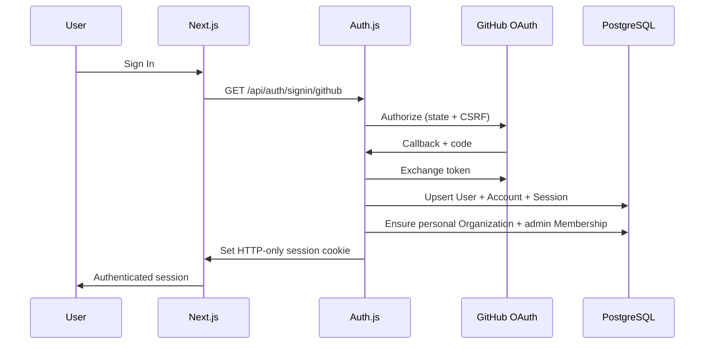

# Authentication Flow — MaintainerAI Phase 2

## Overview

MaintainerAI uses **Auth.js (next-auth v5)** with the **GitHub OAuth** provider and **database sessions** stored in PostgreSQL (`Session`, `Account`, `User`).

Identity is GitHub-backed. Tenancy is organization-backed via `Membership`.



## Endpoints

| Method | Path | Auth | Description |
| ------ | ---- | ---- | ----------- |
| GET/POST | `/api/auth/[...nextauth]` | — | Auth.js handlers (OAuth, CSRF, session cookie) |
| GET | `/api/v1/auth/session` | Optional | Current session + user |
| POST | `/api/v1/auth/logout` | Required | Invalidate session (`everywhere: true` revokes all) |
| GET | `/api/v1/auth/github/install-url` | — | **501/503 stub** — Phase 3 GitHub App |
| GET | `/api/v1/auth/github/callback` | — | **501/503 stub** — Phase 3 GitHub App |
| GET/PATCH/DELETE | `/api/v1/users/me` | Required | Profile |
| GET | `/api/v1/users/me/organizations` | Required | Memberships |
| GET/DELETE | `/api/v1/users/me/sessions` | Required | List / revoke all sessions |
| GET/PATCH | `/api/v1/settings` | Required | Theme, timezone, notification prefs |

## Session strategy

- **Strategy:** database (`Session.sessionToken`)
- **Cookie:** HTTP-only, `SameSite=Lax`, `Secure` in production
- **TTL:** `AUTH_SESSION_MAX_AGE_SECONDS` (default 30 days)
- **Sliding refresh:** `touchSession` extends expiry when less than half TTL remains
- **Logout:** deletes DB session row(s) + clears Auth.js cookies
- **Logout everywhere:** `DELETE /api/v1/users/me/sessions` or `POST /api/v1/auth/logout` with `{ "everywhere": true }`

## First login side effects

On `createUser` / `signIn` events:

1. User row created/updated with `githubId`, `login`, `avatarUrl`, email
2. Personal `Organization` (`type=user`, `githubId=user.githubId`) ensured
3. `Membership` with role `admin` ensured

## Configuration

Required for live OAuth:

```bash
NEXTAUTH_URL=http://localhost:3000
NEXTAUTH_SECRET=<openssl rand -base64 32>
GITHUB_OAUTH_CLIENT_ID=...
GITHUB_OAUTH_CLIENT_SECRET=...
```

GitHub OAuth App callback URL:

```text
{NEXTAUTH_URL}/api/auth/callback/github
```

Without secrets the app still boots (soft validation). OAuth sign-in is unavailable until configured. Set `AUTH_STRICT=true` to fail startup when secrets are missing.

## CSRF

- Auth.js manages CSRF for `/api/auth/*` (OAuth state + CSRF cookies).
- Cookie-authenticated mutating `/api/v1/*` routes enforce **Origin/Referer** checks when `AUTH_CSRF_PROTECT` is enabled (default in production via config).
- Double-submit helpers (`server/auth/csrf.ts`) remain available for clients that set `x-csrf-token`.
- Primary browser defense remains `SameSite=Lax` HTTP-only session cookies.

## Security notes

- Never log `NEXTAUTH_SECRET`, OAuth client secrets, or raw session tokens.
- Session list API returns **fingerprints**, not raw tokens.
- CORS `*` never enables credentials; set explicit `CORS_ORIGIN` for cross-origin cookie clients.
- Deny-by-default: `/api/v1/*` business routes use `withAuth` / `withOrgAuth`.

## Related

- [RBAC_DOCUMENTATION.md](./RBAC_DOCUMENTATION.md)
- [docs/configuration.md](./docs/configuration.md)
- [API_SPECIFICATION.md](./API_SPECIFICATION.md)
