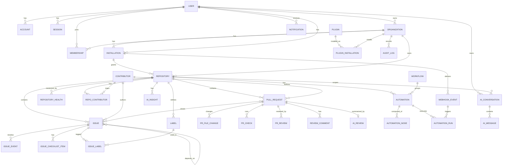

# MaintainerAI — Database Design

> Normalized PostgreSQL schema (via Prisma) for MaintainerAI v1.0.
> Design only — **no migrations are created** as part of this document.
> Derived from the typed fixtures in `lib/mock-data.ts` and `lib/*-types.ts`.

## 1. Conventions

- **Primary keys:** `id` UUID v4 (`@default(uuid())`). GitHub's own numeric IDs are stored separately as `githubId BIGINT` (unique per type) so local IDs never collide with GitHub's.
- **Timestamps:** every table has `createdAt` and `updatedAt` (`@updatedAt`).
- **Soft delete:** `deletedAt TIMESTAMP NULL` on user-owned mutable entities (Repository, Automation, Plugin installs).
- **Tenancy:** every domain row is reachable from an `Organization` or `User` owner; repo-scoped rows carry `repositoryId`.
- **Enums:** modeled as Postgres enums for closed sets (issue state, PR state, roles, severities) matching the UI's literal unions.
- **Money/percent:** health/confidence scores stored as `INT` 0–100 (matching UI).
- **JSONB:** used for flexible payloads (webhook raw body, automation node config, AI message metadata) — everything queried/filtered is a real column.

## 2. Entity Relationship Diagram

## 3. Core Tables

### 3.1 Identity & Tenancy

**User** — a signed-in human (GitHub OAuth identity).
| Column | Type | Notes |
| ------ | ---- | ----- |
| id | UUID PK | |
| githubId | BIGINT UNIQUE | GitHub user id |
| login | TEXT UNIQUE | GitHub handle |
| name | TEXT NULL | |
| email | TEXT UNIQUE NULL | |
| avatarUrl | TEXT NULL | |
| isBot | BOOL default false | |
| createdAt/updatedAt | TIMESTAMP | |

**Account / Session** — Auth.js tables (OAuth tokens, sessions). Standard Auth.js schema; `Account.userId → User.id`, `Session.userId → User.id`.

**Organization** — GitHub org or personal namespace.
| Column | Type | Notes |
| id | UUID PK |
| githubId | BIGINT UNIQUE |
| login | TEXT UNIQUE | org/user login |
| name | TEXT NULL |
| type | ENUM(`user`,`organization`) |
| avatarUrl | TEXT NULL |
| ownerUserId | UUID FK → User.id NULL | personal owner |

**Membership** — user ↔ organization with role.
| userId | UUID FK → User |
| organizationId | UUID FK → Organization |
| role | ENUM(`admin`,`maintainer`,`developer`,`viewer`) | matches `mockTeamMembers` roles |
| PK | (userId, organizationId) |

### 3.2 GitHub Installation

**Installation** — a GitHub App installation (the access grant).
| id | UUID PK |
| githubInstallationId | BIGINT UNIQUE | from GitHub |
| organizationId | UUID FK → Organization |
| status | ENUM(`active`,`suspended`,`deleted`) |
| permissions | JSONB | mirrors `mockGitHubApp.permissions` |
| webhookEvents | TEXT[] | subscribed events |
| rateLimitRemaining | INT NULL |
| rateLimitLimit | INT NULL |
| accountLogin | TEXT NULL | Phase 3 — GitHub account login cache |
| accountType | TEXT NULL | Phase 3 — `User` \| `Organization` |
| suspendedAt | TIMESTAMP NULL | Phase 3 — suspend tracking |
| lastSyncAt | TIMESTAMP NULL |
| syncStatus | ENUM(`idle`,`syncing`,`completed`,`failed`) |

> Installation access tokens are **not** stored in Postgres — they are short-lived and cached in Redis (`gh:install-token:{id}`).

### 3.3 Repository

**Repository** — connected GitHub repo metadata + sync state (Phase 4).
| id | UUID PK |
| githubId | BIGINT UNIQUE |
| nodeId | TEXT NULL | Phase 3 — GitHub node id |
| installationId | UUID FK → Installation |
| organizationId | UUID FK → Organization |
| name | TEXT |
| owner | TEXT | denormalized for display |
| fullName | TEXT UNIQUE | `owner/name` |
| description | TEXT NULL |
| url | TEXT |
| language | TEXT NULL |
| defaultBranch | TEXT NULL | Phase 3 |
| isPrivate | BOOL |
| archived | BOOL default false | Phase 3 |
| disabled | BOOL default false | Phase 3 |
| stars | INT default 0 |
| forks | INT default 0 |
| openIssues | INT default 0 |
| openPRs | INT default 0 |
| collaborators | INT default 0 |
| topics | TEXT[] |
| permissions | JSONB NULL | Phase 3 — permission snapshot |
| healthScore | INT NULL | latest cached score (computed in later phase) |
| automationEnabled | BOOL default false |
| automationIssuesResolved | INT default 0 |
| automationPRsMerged | INT default 0 |
| syncStatus | ENUM(`idle`,`syncing`,`completed`,`failed`) | Phase 4 |
| lastFullSyncAt | TIMESTAMP NULL | Phase 4 |
| lastIncrementalSyncAt | TIMESTAMP NULL | Phase 4 |
| syncError | TEXT NULL | Phase 4 |
| connectedAt | TIMESTAMP NULL | Phase 3 — when connected |
| lastUpdatedGitHub | TIMESTAMP NULL |
| deletedAt | TIMESTAMP NULL | soft disconnect |

**Label** — repo-scoped labels.
| id UUID PK | repositoryId FK | githubId BIGINT NULL | name TEXT | color TEXT | description TEXT NULL | UNIQUE(repositoryId, name) |

### 3.3b Sync ledger (Phase 4)

**SyncJob** — one queued/running/completed/failed/cancelled unit of work per entity.
| id | repositoryId | organizationId | entity (enum) | status | trigger | mode | attempts | error | bullJobId | triggeredBy | metadata | timestamps |

**SyncCheckpoint** — resumable pagination watermark per `(repositoryId, entity)`.
| page | cursor | since | completed | lastSuccessAt | metadata | UNIQUE(repositoryId, entity) |

**Milestone / Release / Branch** — synchronized GitHub resources (additive Phase 4 models).

### 3.4 Contributor

**Contributor** — a GitHub actor (may not be an app User). From `mockContributors` + `ContributorProfile`.
| id | UUID PK |
| githubId | BIGINT UNIQUE |
| login | TEXT UNIQUE |
| name | TEXT NULL |
| avatarUrl | TEXT NULL |
| bio / location / company | TEXT NULL |
| followers / following | INT |
| isBotAccount | BOOL default false |
| joinedAt / lastActive | TIMESTAMP NULL |

**RepoContributor** — per-repo contributor analytics (join with metrics).
| repositoryId FK | contributorId FK | contributions INT | issuesOpened/Closed INT | prOpened/prMerged/prRejected INT | reviewCount INT | averageReviewTime TEXT | averageMergeTime TEXT | isMaintainer BOOL | PK(repositoryId, contributorId) |

**ContributorBadge** — earned badges (from `badgeTypes`).
| id | contributorId FK | type TEXT | earnedAt TIMESTAMP | UNIQUE(contributorId, type) |

### 3.5 Issues

**Issue** — synchronized from GitHub (Phase 4); product workflow fields remain nullable.
| id | UUID PK |
| githubId | BIGINT UNIQUE |
| nodeId | TEXT NULL |
| repositoryId | UUID FK → Repository |
| number | INT | GitHub issue number |
| title | TEXT |
| description | TEXT NULL |
| htmlUrl | TEXT NULL |
| state | ENUM (GitHub sync uses `open`/`closed`) |
| locked | BOOL |
| priority | ENUM NULL | product (not GitHub) |
| commentsCount | INT default 0 |
| aiGenerated | BOOL default false |
| authorContributorId | UUID FK → Contributor NULL |
| milestoneId | UUID FK → Milestone NULL |
| githubCreatedAt / githubUpdatedAt / closedAt | TIMESTAMP NULL |
| createdAt/updatedAt | TIMESTAMP | UNIQUE(repositoryId, number) |

**IssueLabel** — M:N Issue↔Label. PK(issueId, labelId).

**IssueAssignee** — M:N Issue↔Contributor. PK(issueId, contributorId).

**IssueDependency** — self M:N. `(issueId, dependsOnIssueId, type ENUM(depends-on, blocks))`.

**IssueEvent** — timeline (`IssueTimelineEvent`).
| id UUID PK | issueId FK | type ENUM(`status-change`,`comment`,`assignment`,`label-change`,`review`) | title TEXT | description TEXT NULL | actor TEXT | metadata JSONB NULL | createdAt |

**IssueChecklistItem** — `id | issueId FK | title | completed BOOL | checkedAt TIMESTAMP NULL`.

### 3.6 Pull Requests

**PullRequest** — from `mockPullRequests` + `PRReviewDetail`.
| id | UUID PK |
| githubId | BIGINT UNIQUE |
| repositoryId | UUID FK |
| number | INT |
| title | TEXT |
| description | TEXT NULL |
| state | ENUM(`draft`,`open`,`review`,`approved`,`merged`,`closed`) |
| authorContributorId | UUID FK → Contributor NULL |
| additions / deletions / commits | INT default 0 |
| commentsCount | INT default 0 |
| reviewRequests | INT default 0 |
| ciStatus | ENUM(`success`,`failure`,`pending`) NULL |
| testCoverageCurrent | INT NULL |
| testCoverageChange | INT NULL |
| documentationCoverage | BOOL NULL |
| mergeReadinessScore | INT NULL |
| aiReviewCompleted | BOOL default false |
| createdAt/updatedAt | TIMESTAMP | UNIQUE(repositoryId, number) |

**PrFileChange** — `CodeChange`: `id | pullRequestId FK | file TEXT | additions INT | deletions INT | changes INT | status ENUM(added,modified,deleted) | diff TEXT NULL`.

**PrCheck** — `ReviewCheck`: `id | pullRequestId FK | name TEXT | status ENUM(passed,failed,pending) | description TEXT | url TEXT NULL | createdAt`.

**PrReview** — human review: `id | pullRequestId FK | reviewerContributorId FK | state ENUM(approve,request-changes,comment) | createdAt`.

**ReviewComment** — threaded (`ReviewComment.replies` → self FK): `id | pullRequestId FK | parentCommentId FK NULL | authorContributorId FK | content TEXT | file TEXT NULL | line INT NULL | createdAt`.

**AIReview** — 1:1 with PR (`AIReviewSummary` + analyses): `id | pullRequestId FK UNIQUE | summary TEXT | keyFindings TEXT[] | approvalRecommendation ENUM(approve,request-changes,comment) | confidence INT | securityRisk ENUM(critical,high,medium,low,none) | securityIssues JSONB | performanceIssues JSONB | breakingChanges JSONB | suggestedChanges JSONB | mergeBlockers TEXT[] | mergeWarnings TEXT[] | createdAt`.

**PrClosesIssue** — M:N PR↔Issue. PK(pullRequestId, issueId).

### 3.7 Health & Insights

**RepositoryHealth** — history of scores (from `mockRepositoryHealth`).
| id UUID PK | repositoryId FK | codeQuality INT | documentation INT | issueBacklog INT | prBacklog INT | contributorActivity INT | ciStatus ENUM(passing,failing,unknown) | releaseFrequency TEXT | automationCoverage INT | securityAlerts INT | dependencyHealth INT | measuredAt TIMESTAMP |
| INDEX (repositoryId, measuredAt DESC) | latest lookup |

**AIInsight** — from `mockAIInsights`.
| id UUID PK | repositoryId FK | title TEXT | description TEXT | severity ENUM(low,medium,high) | confidence INT | suggestedAction TEXT | quickFixAvailable BOOL | category TEXT | resolvedAt TIMESTAMP NULL | createdAt |

### 3.8 Automation

**Workflow** — optional grouping of automations per repo/org.
| id UUID PK | organizationId FK | repositoryId FK NULL | name TEXT | description TEXT NULL |

**Automation** — from `mockAutomations` + builder `AutomationWorkflow`.
| id UUID PK | repositoryId FK | workflowId FK NULL | name TEXT | description TEXT NULL | enabled BOOL default false | status ENUM(active,inactive,error) | runsCount INT default 0 | successRate INT default 0 | lastExecutionAt TIMESTAMP NULL | createdAt/updatedAt | deletedAt NULL |

**AutomationNode** — builder graph nodes (`WorkflowNode`).
| id UUID PK | automationId FK | type ENUM(trigger,action,condition,notification) | subtype TEXT | title TEXT | description TEXT NULL | config JSONB | position INT | status ENUM(active,inactive) |

**AutomationRun** — execution log.
| id UUID PK | automationId FK | webhookEventId FK NULL | status ENUM(success,failure,skipped) | trigger TEXT | detail JSONB NULL | durationMs INT NULL | createdAt |
| INDEX (automationId, createdAt DESC) |

### 3.9 AI Conversations

**AIConversation** — from `CopilotConversation`.
| id UUID PK | userId FK → User | repositoryId FK NULL | title TEXT | isPinned BOOL default false | createdAt/updatedAt |

**AIMessage** — from `CopilotMessage`.
| id UUID PK | conversationId FK | role ENUM(user,assistant,system) | content TEXT | action TEXT NULL | isPinned BOOL default false | promptTokens INT NULL | completionTokens INT NULL | model TEXT NULL | metadata JSONB NULL | createdAt |
| INDEX (conversationId, createdAt) |

### 3.10 Notifications

**Notification** — from `mockNotifications`.
| id UUID PK | userId FK → User | type ENUM(pr_merged,issue_assigned,review_requested,automation,system) | title TEXT | description TEXT NULL | link TEXT NULL | isRead BOOL default false | repositoryId FK NULL | createdAt |
| INDEX (userId, isRead, createdAt DESC) |

### 3.11 Plugins / Marketplace

**Plugin** — catalog entry.
| id UUID PK | slug TEXT UNIQUE | name TEXT | description TEXT | category TEXT | author TEXT | version TEXT | official BOOL default false | manifest JSONB | createdAt/updatedAt |

**PluginInstallation** — org installs a plugin.
| id UUID PK | pluginId FK | organizationId FK | repositoryId FK NULL | enabled BOOL default true | config JSONB NULL | installedAt | UNIQUE(pluginId, organizationId, repositoryId) |

### 3.12 System

**WebhookEvent** — idempotent webhook ledger.
| id UUID PK | installationId FK NULL | deliveryId TEXT UNIQUE | event TEXT | action TEXT NULL | payload JSONB | signatureValid BOOL | processedAt TIMESTAMP NULL | status ENUM(received,processing,processed,failed) | createdAt |
| INDEX (event, createdAt DESC) |

**AuditLog** — every mutation.
| id UUID PK | organizationId FK NULL | actorUserId FK NULL | action TEXT | targetType TEXT | targetId TEXT | metadata JSONB NULL | ip TEXT NULL | createdAt |
| INDEX (organizationId, createdAt DESC) |

**ApiKey** (Future/SDK) — `id | organizationId FK | name | hashedKey TEXT UNIQUE | scopes TEXT[] | lastUsedAt | revokedAt NULL | createdAt`.

## 4. Index Strategy

| Table | Index | Purpose |
| ----- | ----- | ------- |
| Repository | UNIQUE(fullName), (organizationId), (installationId) | lookups, tenant lists |
| Issue | UNIQUE(repositoryId, number), (repositoryId, state), (authorContributorId) | board/filter views |
| PullRequest | UNIQUE(repositoryId, number), (repositoryId, state), (ciStatus) | PR list/review queue |
| RepositoryHealth | (repositoryId, measuredAt DESC) | latest + trend |
| AutomationRun | (automationId, createdAt DESC) | run history |
| AIMessage | (conversationId, createdAt) | conversation load |
| Notification | (userId, isRead, createdAt DESC) | inbox |
| WebhookEvent | UNIQUE(deliveryId), (event, createdAt) | idempotency + audit |
| AuditLog | (organizationId, createdAt DESC) | activity feed |
| Contributor/Issue/PR | UNIQUE(githubId) each | dedupe on sync/upsert |

## 5. Foreign Keys & Cascade Rules

- `Repository.installationId → Installation` **ON DELETE RESTRICT** (never orphan a repo silently; require explicit teardown).
- Repo-scoped children (Issue, PullRequest, Label, Automation, RepositoryHealth, AIInsight) → `Repository` **ON DELETE CASCADE**.
- Issue/PR children (events, checklist, file changes, checks, comments, AIReview) → parent **ON DELETE CASCADE**.
- `AIConversation.userId → User` **ON DELETE CASCADE**; `AIMessage → AIConversation` **CASCADE**.
- `Membership`, `IssueLabel`, `IssueAssignee`, `PrClosesIssue`, `IssueDependency` are join tables with composite PKs and **CASCADE** on both parents.
- `AuditLog.actorUserId` **ON DELETE SET NULL** (retain audit trail after user deletion).
- Contributor references (`authorContributorId`) **ON DELETE SET NULL** (contributors persist independently of app users).

## 6. Normalization Notes

- **3NF baseline.** Repeating groups (labels, assignees, dependencies) are extracted into join tables rather than arrays, except low-cardinality display arrays (`topics`, `potentialFilesAffected`, `webhookEvents`) kept as `TEXT[]` for read simplicity.
- **Denormalized counters** (`healthScore`, `openIssues`, `runsCount`, `successRate`) are cached aggregates maintained by workers; the source of truth remains the child rows / GitHub. Documented as derived to avoid drift confusion.
- **GitHub vs local identity** kept separate (`id` UUID vs `githubId` BIGINT) to allow entities to exist before/without GitHub linkage.
- **pgvector-ready:** an optional `embedding vector` column on Issue/PR (behind a flag) supports duplicate detection and "ask repository" without schema churn.

## 7. Migration Sequencing (for roadmap, not executed here)

1. Identity: User, Account, Session, Organization, Membership.
2. Installation + Repository + Label.
3. Contributor + RepoContributor + ContributorBadge.
4. Issue graph (Issue, IssueLabel, IssueAssignee, IssueDependency, IssueEvent, IssueChecklistItem).
5. PR graph (PullRequest, PrFileChange, PrCheck, PrReview, ReviewComment, AIReview, PrClosesIssue).
6. Health + AIInsight.
7. Automation (Workflow, Automation, AutomationNode, AutomationRun).
8. AI (AIConversation, AIMessage), Notification.
9. Plugin, PluginInstallation.
10. System (WebhookEvent, AuditLog, ApiKey).
