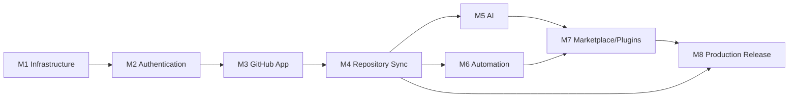

# MaintainerAI — Development Roadmap

> Sequenced plan to turn the mock-driven UI into a production platform (v1.0).
> Companion: `PROJECT_ANALYSIS.md`, `SYSTEM_ARCHITECTURE.md`, `DATABASE_DESIGN.md`, `API_SPECIFICATION.md`.
> Complexity scale: **S** (≤2 days) · **M** (≤1 week) · **L** (1–2 weeks) · **XL** (2+ weeks).
> Golden rule for every milestone: **do not modify the UI/design system**; replace data sources behind it.

## Dependency Graph

## Cross-Cutting Foundations (start in M1, mature through M8)

- Typed API client (`lib/api/*`) and a data-access layer (`server/db/*`) so pages migrate off `lib/mock-data.ts` incrementally.
- Zod validation, structured logging (pino), error envelope, and audit logging introduced with the first endpoints.
- Testing harness (Vitest + Testing Library + Playwright) seeded in M1, expanded per milestone.
- Remove `typescript.ignoreBuildErrors` from `next.config.mjs` once real server code compiles cleanly (target: end of M2).

---

## Milestone 1 — Infrastructure

**Goal:** stand up the backend substrate (DB, Redis, Prisma, worker, config, CI) with zero user-facing change.

**Tasks**
- Add Prisma + PostgreSQL; implement the schema from `DATABASE_DESIGN.md` (migrations only, no seeding of fake data).
- Add Redis (cache + BullMQ) and a `worker` process/entrypoint.
- Create data-access layer (`server/db/prisma.ts`) and typed API client scaffold (`lib/api/`).
- Establish env contract + validation (`server/env.ts`, `zod`), update `.env.example`.
- Extend `docker-compose.yml`: `postgres`, `redis`, `worker`, one-shot `migrate`; wire `/api/health` + `/api/ready`.
- Add logging (pino), error envelope helper, and base test setup (Vitest + Playwright config).
- CI: add typecheck-with-real-errors gate (plan to flip `ignoreBuildErrors`), Prisma validate, migration check.

**Dependencies:** none.
**Complexity:** L.
**Files affected:** `prisma/schema.prisma` (new), `server/db/*` (new), `server/env.ts` (new), `lib/api/*` (new), `docker-compose.yml`, `Dockerfile` (worker entrypoint), `package.json` (deps + scripts), `.env.example`, `app/api/health/route.ts` + `app/api/ready/route.ts` (new), `.github/workflows/ci.yml`.

---

## Milestone 2 — Authentication

**Status:** ✅ Complete (`v0.2.0-auth` candidate) — see `PHASE2_COMPLETION_SUMMARY.md`

**Goal:** real GitHub OAuth login, sessions, tenancy, and authorization scaffolding.

**Tasks**
- [x] Integrate Auth.js (GitHub provider) with database sessions (`User`, `Account`, `Session`).
- [x] Implement `Organization`/`Membership` resolution and role model (`admin/maintainer/developer/viewer`).
- [x] Build session/tenant/authorization middleware for `/api/v1/*` (the pipeline in `SYSTEM_ARCHITECTURE.md` §7).
- [x] Implement Authentication + Users + Organizations endpoints (`API_SPECIFICATION.md` §3–5) + invitations.
- [x] Wire Sign In / Connect GitHub to Auth.js (minimal; no UI redesign). Full settings page data wiring can continue incrementally.
- [x] Add auth/authorization unit + integration tests. `ignoreBuildErrors` already false from Phase 1.

**Dependencies:** M1.
**Complexity:** L.
**Files affected:** `app/api/auth/[...nextauth]/route.ts`, `app/api/v1/{auth,users,orgs,invitations,settings}/**`, `server/auth/*`, `middleware.ts`, onboarding/marketing Sign In links.

---

## Milestone 3 — GitHub App

**Goal:** real GitHub App installation, token exchange, webhook receiver.

**Tasks**
- Implement App JWT signing + installation-token exchange; cache tokens in Redis with refresh.
- Build Octokit wrapper (`server/github/*`) with rate-limit accounting.
- Implement installation callback linking `Installation` ↔ `Organization` (`/api/v1/auth/github/callback`).
- Implement `/api/webhooks/github`: HMAC verify, `WebhookEvent` persistence (idempotent by delivery id), enqueue + `202`.
- Implement GitHub/Installations endpoints (`API_SPECIFICATION.md` §6); wire `/github-app` and `/install` UI to real data (`mockGitHubApp` → API).

**Dependencies:** M2.
**Complexity:** XL.
**Files affected:** `server/github/*` (new), `app/api/webhooks/github/route.ts` (new), `app/api/v1/github/**` (new), `server/queue/*` (new: queues + producers), `app/github-app/page.tsx`, `app/install/page.tsx`, `app/onboarding/connect-github/page.tsx` (data sources).

---

## Milestone 4 — Repository Sync

**Goal:** mirror real repos/issues/PRs/contributors and compute health; the dashboard shows live data.

**Tasks**
- Implement sync workers: repositories, issues (+labels/assignees/timeline), pull requests (+files/checks/reviews), contributors (+analytics), releases.
- Webhook workers reconcile incremental changes (`issues`, `pull_request`, `issue_comment`, `pull_request_review`, `push`, `release`).
- Implement Health Scoring Engine (`RepositoryHealth`) + recompute on webhook/schedule.
- Implement Repositories, Issues, PRs, Contributors, Notifications endpoints (`API_SPECIFICATION.md` §7–10, §15).
- Migrate dashboard, repositories, issues, pull-requests, contributors, health, insights, activity pages off `lib/mock-data.ts` to Server Components + API (markup unchanged).
- Scheduler (repeatable jobs): periodic resync, stale sweeps prep.

**Dependencies:** M3.
**Complexity:** XL.
**Files affected:** `server/workers/{sync-*,webhook-*}.ts` (new), `server/services/health.ts` (new), `app/api/v1/repos/**` (new), `app/api/v1/notifications/**` (new), `app/{dashboard,repositories,issues,pull-requests,contributors,health,insights,activity}/page.tsx` (data sources), `components/repository/*`, `components/issues/*`, `components/pr-review/*`, `components/contributors/*` (props/data only), retire `lib/mock-data.ts` usage progressively.

---

## Milestone 5 — AI

**Goal:** real AI provider layer, streaming copilot, and the 12 copilot actions against real repo context.

**Tasks**
- Implement provider abstraction (OpenAI/Anthropic/Azure/Ollama) selectable via env; token/usage accounting.
- Implement SSE streaming transport (`/api/v1/ai/stream`) and replace `setTimeout` in `hooks/use-copilot.ts` with real streaming.
- Implement prompt/context builder + per-action templates for all 12 `CopilotAction`s; persist `AIConversation`/`AIMessage`.
- Implement AI endpoints (`API_SPECIFICATION.md` §11); wire PR AI review (`AIReview`) and repo insights generation.
- Optional: pgvector embeddings for duplicate detection + "ask repository".
- AI error handling, timeouts, provider fallbacks, cost guards.

**Dependencies:** M4 (needs real repo context).
**Complexity:** XL.
**Files affected:** `server/ai/*` (new: providers, router, prompts, context), `app/api/v1/ai/**` (new), `hooks/use-copilot.ts` (transport), `components/copilot/ai-copilot-panel.tsx` (streaming consumption), `app/ai-generator/page.tsx`, `components/pr-review/pr-review-screen.tsx` (AI review data).

---

## Milestone 6 — Automation

**Goal:** execute automations from the visual builder against real GitHub events.

**Tasks**
- Persist automations as `Automation` + `AutomationNode` from the builder; implement CRUD endpoints (`API_SPECIFICATION.md` §12).
- Implement Automation Engine (trigger match → conditions → actions) as a worker consuming webhook/scheduler jobs; log `AutomationRun`.
- Implement built-in templates: auto-label, stale-issue sweep, welcome first-timer, issue-claim.
- Wire `/automation` UI + `automation-builder.tsx` save/load to API; show real runs/success rate.
- Rate-limit-aware, idempotent GitHub writes; per-run audit logging.

**Dependencies:** M4 (events + writes); can parallelize with M5.
**Complexity:** XL.
**Files affected:** `server/automation/*` (new: engine, conditions, actions, templates), `server/workers/automation-*.ts` (new), `app/api/v1/repos/:repoId/automations/**` + `app/api/v1/automations/**` (new), `app/automation/page.tsx`, `components/automation/automation-builder.tsx` (persistence only).

---

## Milestone 7 — Marketplace & Plugins

**Goal:** first-class capability registry and installable plugins (first-party in v1.0).

**Tasks**
- Implement `Plugin` catalog + `PluginInstallation`; Marketplace + Plugins endpoints (`API_SPECIFICATION.md` §13–14).
- Model built-in automations/AI actions as first-party plugins with manifests.
- Wire `/marketplace` and `/integrations` UI to real catalog + install/enable/config flows.
- Define plugin manifest schema + permission model (foundation for future sandboxed third-party plugins).

**Dependencies:** M5 + M6.
**Complexity:** L.
**Files affected:** `server/plugins/*` (new), `app/api/v1/{marketplace,plugins}/**` (new), `app/marketplace/page.tsx`, `app/integrations/page.tsx` (data sources).

---

## Milestone 8 — Production Release

**Goal:** hardening, observability, docs, and shippable self-host + SaaS.

**Tasks**
- Observability: Sentry (web/server/worker), structured logs with correlation IDs, queue/rate-limit metrics, optional Prometheus.
- Security pass: authz review, webhook/signature tests, secrets management, dependency + CodeQL gates, rate-limit tuning.
- Settings completion (`API_SPECIFICATION.md` §16): AI config, notification prefs, API keys (SDK seed).
- Performance: caching strategy, Server Component adoption audit, re-enable Next image optimization, bundle review.
- Testing: e2e coverage of core journeys (login → install → sync → triage → AI → automation); load test webhook/sync path.
- Docs: update `/docs/*` (deployment with DB/Redis/worker, GitHub App setup, AI providers, self-host compose), finalize `.env.example`.
- Release: versioning, CHANGELOG, migration runbook, backup/restore guidance, `docker compose up` self-host validation.

**Dependencies:** M1–M7.
**Complexity:** L–XL.
**Files affected:** `server/observability/*` (new), `app/api/v1/settings/**` (new), `next.config.mjs` (image opt), `docker-compose.yml` (prod profile), `.github/workflows/*`, `docs/**`, `CHANGELOG.md`, `README.md`.

---

## Summary Table

| Milestone | Focus | Depends on | Complexity | Primary new dirs |
| --------- | ----- | ---------- | ---------- | ---------------- |
| M1 | Infrastructure | — | L | `prisma/`, `server/db`, `server/queue`, `lib/api` |
| M2 | Authentication | M1 | L | `server/auth`, `app/api/v1/{auth,users,orgs}` |
| M3 | GitHub App | M2 | XL | `server/github`, `app/api/webhooks` |
| M4 | Repository Sync | M3 | XL | `server/workers`, `server/services`, `app/api/v1/repos` |
| M5 | AI | M4 | XL | `server/ai`, `app/api/v1/ai` |
| M6 | Automation | M4 | XL | `server/automation`, `app/api/v1/.../automations` |
| M7 | Marketplace/Plugins | M5, M6 | L | `server/plugins`, `app/api/v1/{marketplace,plugins}` |
| M8 | Production Release | M1–M7 | L–XL | `server/observability`, docs, deploy |

## Post-v1.0 (Future)

- Public REST API + API keys, then the **TS SDK**, **CLI**, and **VS Code extension** (thin clients over `/api/v1`).
- Sandboxed third-party plugin runtime with capability-scoped tokens and signed distribution.
- Multi-org billing/plans (Pricing is already flagged "Soon" in the marketing nav).
