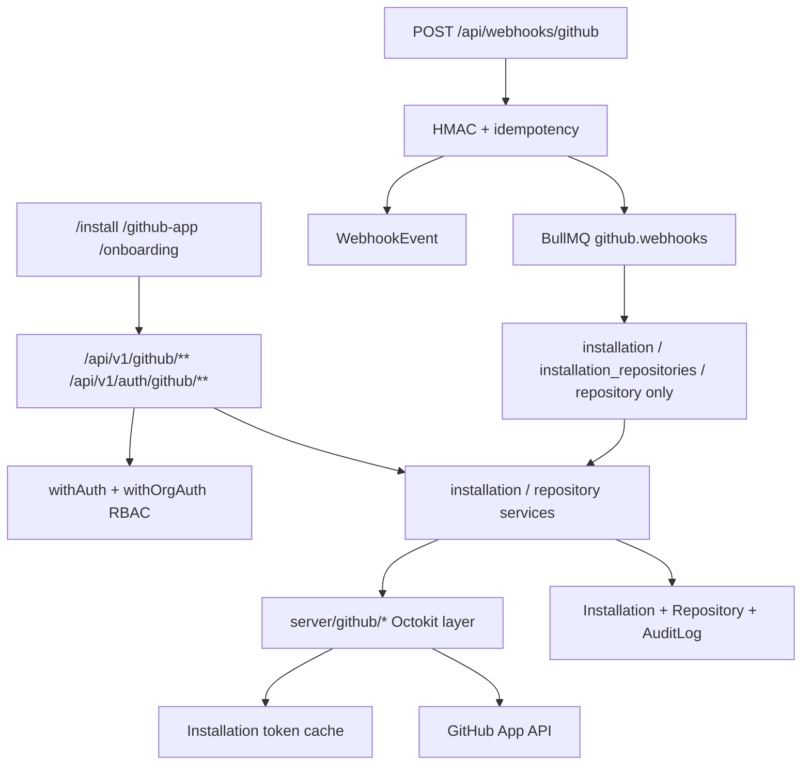

# Phase 3 Implementation Plan — GitHub App Platform

**Status:** Approved for implementation  
**Baseline:** `v0.2.0-auth`  
**Target tag:** `v0.3.0-github-app`  
**Constraint:** No Phase 4 (issue/PR/commit sync). No AI / Automation / Marketplace. Secrets via env only.

---

## 1. Architecture



### Design principles

1. **Single GitHub boundary:** no route/handler calls Octokit directly — only `server/github/*`.
2. **Reuse Prisma models:** `Installation`, `Repository`, `WebhookEvent` already match `DATABASE_DESIGN.md`. Do **not** invent parallel `GitHubInstallation` / `WebhookDelivery` tables.
3. **Connected repo = Repository row** (soft-delete via `deletedAt` for disconnect).
4. **Tokens in Redis only** — never persist installation tokens in Postgres.
5. **Personal installs** link to the user’s personal `Organization` (`type=user`). Org installs resolve/create `Organization` by GitHub org id/login.

---

## 2. GitHub App lifecycle

| Step | Behavior |
| ---- | -------- |
| Configure | Env: `GITHUB_APP_ID`, `GITHUB_APP_CLIENT_ID`, `GITHUB_APP_CLIENT_SECRET`, `GITHUB_APP_PRIVATE_KEY`, `GITHUB_WEBHOOK_SECRET`, `GITHUB_APP_SLUG` |
| Install URL | `GET /api/v1/auth/github/install-url` → GitHub App install URL (+ optional `state` CSRF) |
| Callback | `GET /api/v1/auth/github/callback?installation_id=&setup_action=` → verify session, fetch install from GitHub, upsert `Installation`, link org, seed accessible repos metadata |
| Reinstall | Same callback; upsert by `githubInstallationId` |
| Uninstall | Webhook `installation.deleted` / API disconnect → status `deleted`, soft-delete repos |
| Health | Status, permissions JSON, rate-limit snapshot, webhook last delivery |

---

## 3. Installation flow

```
User (authenticated)
  → GET install-url (state cookie)
  → GitHub App install UI
  → Redirect callback with installation_id
  → Exchange / verify via App JWT + Octokit
  → Resolve Organization (personal or GitHub org)
  → Upsert Installation
  → List installation repositories (metadata)
  → Upsert Repository rows (connected by default for selected/all accessible)
  → AuditLog
  → Redirect /github-app or /onboarding/select-repositories
```

---

## 4. Repository connection flow

| Action | API | DB |
| ------ | --- | -- |
| Discover | `GET .../installations/:id/repositories` (live GitHub + DB merge) | — |
| Connect | `POST .../repositories/connect` `{ githubIds: number[] }` | Upsert Repository, clear `deletedAt` |
| Disconnect | `DELETE .../repositories/:repoId` | Set `deletedAt` |
| Refresh metadata | `POST .../repositories/:repoId/refresh` or installation refresh | Update metadata fields only |
| List connected | `GET /api/v1/repos` (org-scoped) | `deletedAt IS NULL` |

**Metadata only:** githubId, owner, name, fullName, url, description, language, isPrivate, stars, forks, default branch (add column if missing), topics, permissions snapshot, lastUpdatedGitHub. **No** issues/PRs/commits sync.

---

## 5. Webhook flow

```
POST /api/webhooks/github
  → Verify X-Hub-Signature-256 (GITHUB_WEBHOOK_SECRET)
  → Idempotent insert WebhookEvent by X-GitHub-Delivery
  → Enqueue job (202)
  → Worker/dispatcher handles:
       installation
       installation_repositories
       repository
  → Ignore all other events (persist + mark processed/skipped)
```

Replay protection: reject invalid signatures; duplicate `deliveryId` → `200` no-op.

---

## 6. Database changes

### Reuse (no rename)

- `Installation` ≡ GitHub App installation record  
- `Repository` ≡ connected repository metadata  
- `WebhookEvent` ≡ delivery log  

### Additive only

| Change | Why |
| ------ | --- |
| `Repository.defaultBranch String?` | Spec metadata |
| `Repository.nodeId String?` | GitHub node id |
| `Repository.archived Boolean @default(false)` | Spec |
| `Repository.disabled Boolean @default(false)` | Spec |
| `Repository.permissions Json?` | Collaborator/install permission snapshot |
| `Repository.connectedAt DateTime?` | When user connected |
| `Installation.accountLogin String?` | GitHub account login cache |
| `Installation.accountType String?` | `User` \| `Organization` |
| `Installation.suspendedAt DateTime?` | Suspend tracking |

Migration: `20260801120000_phase3_github_app` (additive).

`DATABASE_DESIGN.md` updated to document these additive fields as Phase 3 extensions.

---

## 7. Security model

| Control | Implementation |
| ------- | -------------- |
| Private key | PEM from env (`\n` unescape); never logged |
| App JWT | Short-lived (≤10 min), generated in `server/github/app-auth.ts` |
| Install token | Redis TTL ≈ expires_at − 60s |
| Webhook HMAC | timing-safe compare of `sha256=` digest |
| State CSRF | Signed/random state cookie for install URL |
| RBAC | All `/api/v1/github/**` and repo mutate via `withAuth` / `withOrgAuth` |
| Audit | `writeAuditLog` on install/uninstall/connect/disconnect |
| Rate limits | GitHub `x-ratelimit-*` stored on Installation; App-layer retries + backoff |

---

## 8. Rate limiting & token lifecycle

1. Create App JWT → `POST /app/installations/{id}/access_tokens`  
2. Cache token in Redis key `gh:install-token:{installationId}`  
3. On 401 from GitHub → invalidate cache + refresh once  
4. On secondary rate limit → exponential backoff + `Retry-After`  
5. Persist remaining/limit on Installation for UI  

---

## 9. Caching

| Key | TTL | Value |
| --- | --- | ----- |
| `gh:install-token:{uuid}` | until expiry−60s | token string |
| Optional `gh:install-meta:{uuid}` | 60s | JSON rate-limit snapshot |

---

## 10. Testing strategy

- Unit: JWT builder (mocked key), HMAC verify, webhook dispatcher routing, permission checks  
- Integration: install-url (configured vs not), webhook invalid signature 401, duplicate delivery idempotency, connect/disconnect with mocked Octokit  
- No real GitHub calls in CI — inject fake Octokit  

---

## 11. Deployment

1. Create GitHub App (documented in `GITHUB_APP_SETUP.md`)  
2. Set env in `.env.local` / Compose  
3. `pnpm db:migrate:deploy`  
4. Webhook URL: `{APP_URL}/api/webhooks/github`  
5. Flip `features.githubApp: true` when configured  

Rollback: revert deploy; migration additive (safe); mark installations deleted if needed.

---

## 12. Risk assessment

| Risk | Mitigation |
| ---- | ---------- |
| Private key format errors | Validate PEM at startup when `GITHUB_APP_STRICT` / configured |
| Org mismatch on install | Resolve account from GitHub API; create/link Organization |
| Webhook flood | Idempotency + queue + ignore unknown events |
| Dashboard still mixed mocks | Replace repo lists on dashboard/github-app/install/select-repos; leave marketing preview mocks |
| Token leakage | Redact in logger; never return tokens from API |

---

## 13. Acceptance criteria

- [ ] GitHub layer with JWT + install tokens + Octokit  
- [ ] Install URL + callback persist Installation  
- [ ] Repository discovery + connect/disconnect (metadata only)  
- [ ] Webhook verify + log + dispatch 3 event types  
- [ ] Protected APIs + RBAC  
- [ ] Dashboard / github-app / select-repos use live connected repos when installed  
- [ ] Docs: `GITHUB_APP_SETUP.md`, `WEBHOOKS.md`, Phase 3 summaries  
- [ ] Gates: typecheck, lint, test, build, prisma, infra  
- [ ] Decision: `✅ PHASE 3 COMPLETE — READY TO CREATE TAG v0.3.0-github-app`  

---

## 14. Implementation order

1. Plan (this doc)  
2. Config + deps (`@octokit/app`, `@octokit/rest`, `@octokit/auth-app`, `jose` or Octokit auth)  
3. Prisma additive migration  
4. `server/github/*`  
5. Services: installation, repository-github, webhook  
6. Auth install-url/callback + `/api/v1/github/**` + webhook route  
7. Queue job + dispatcher  
8. UI wiring (minimal — data sources only)  
9. Tests  
10. Docs + validation + `PHASE3_*` reports  

---

## 15. Out of scope (Phase 4+)

Issue/PR/commit sync, health scoring from GitHub, AI, automation execution, marketplace, GraphQL product features (hooks only), CLI/SDK.
