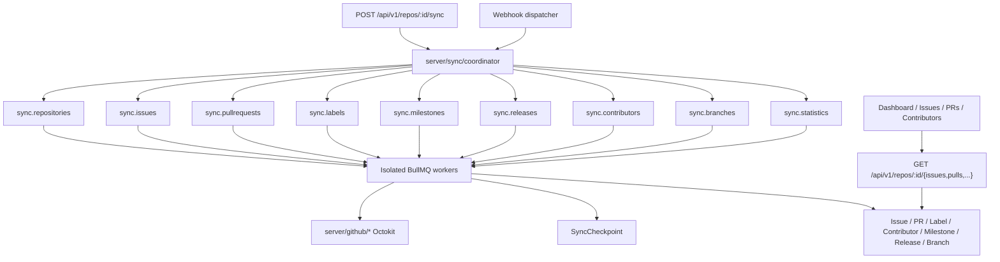

# Phase 4 Implementation Plan — Repository Synchronization Engine

**Status:** Approved for implementation  
**Baseline:** `v0.3.0-github-app` (Phase 3 complete)  
**Target tag:** `v0.4.0-repository-sync`  
**Constraint:** No AI · No Repository Health scoring · No Automation · No Analytics · No Marketplace. Secrets via env only.

---

## 1. Architecture



### Design principles

1. **Sync ≠ business logic.** `server/sync/*` acquires and upserts GitHub data only. No AI, scoring, or automation side-effects.
2. **GitHub is authoritative.** Local Postgres is a synchronized cache; upserts are idempotent by `githubId` / `(repositoryId, number)`.
3. **Reuse Prisma product models** (`Issue`, `PullRequest`, `Label`, `Contributor`, `RepoContributor`) — same pattern as Phase 3 reusing `Installation`. Do **not** invent parallel `GitHubIssue` tables.
4. **Additive schema only** for sync ledger (`SyncJob`, `SyncCheckpoint`) and missing resources (`Milestone`, `Release`, `Branch`) plus small fields (`closedAt`, `htmlUrl`, `Label.githubId`, repo sync columns).
5. **All sync is async.** API/webhook handlers enqueue jobs and return `202` / acknowledge. Workers do Octokit + DB work.
6. **Isolated queues** — one queue (and worker) per domain; no giant monolith worker.
7. **Checkpoints + retries** — cursor/page persisted; jobs survive crashes; BullMQ attempts + DLQ.

---

## 2. Synchronization lifecycle

```
Trigger (manual API | webhook | schedule)
  → Create SyncJob (status=queued)
  → Enqueue domain fan-out (or single domain for webhook delta)
  → Worker claims job → status=running
  → Load SyncCheckpoint (entity, cursor, page)
  → Paginate GitHub → batch upsert → advance checkpoint
  → On success: SyncJob completed; Repository.syncStatus=completed; lastSyncAt=now
  → On failure: retry / backoff; after max → failed + DLQ; checkpoint retained for resume
  → Cancel: SyncJob cancelled; workers exit cooperatively between pages
```

### Modes

| Mode | Behavior |
| ---- | -------- |
| Initial / full | Sync all entities for a connected repository from page 1 |
| Incremental | Use `since` / updated_at watermark from checkpoint |
| Webhook delta | Single-resource upsert (issue #N, label name, etc.) |
| Metadata refresh | Repository row only (existing Phase 3 path; also via `sync.repositories`) |
| Scheduled | Repeatable BullMQ job per org/installation (staggered) |

---

## 3. Queue architecture

| Queue | Job name | Responsibility |
| ----- | -------- | -------------- |
| `sync.repositories` | `sync.repository.run` | Repo metadata + orchestrate child domain jobs |
| `sync.issues` | `sync.issues.run` | Issues + labels/assignees links |
| `sync.pullrequests` | `sync.pullrequests.run` | PRs + basic review/file counts |
| `sync.labels` | `sync.labels.run` | Labels |
| `sync.milestones` | `sync.milestones.run` | Milestones |
| `sync.releases` | `sync.releases.run` | Releases |
| `sync.contributors` | `sync.contributors.run` | Contributors + RepoContributor stats |
| `sync.branches` | `sync.branches.run` | Branches |
| `sync.statistics` | `sync.statistics.run` | Denormalized counters on Repository |

**Defaults:** `attempts: 5`, exponential backoff starting 3s, `removeOnComplete` age 24h, `removeOnFail` age 7d. Failed jobs after max attempts land in BullMQ failed set (operational DLQ); optional `sync.deadletter` mirror job for audit.

**Concurrency:** low per queue (1–3) to respect GitHub secondary rate limits; token reuse via existing Redis install-token cache.

---

## 4. Worker architecture

- Extend `scripts/worker.ts` to start all sync workers (+ existing infra/webhook).
- Each worker: `server/queue/jobs/sync-*.ts` or `server/sync/workers/*.ts` registered independently.
- Cooperative cancel: check `SyncJob.status === cancelled` between pages.
- No Octokit calls from API routes — only via `server/github` inside workers/services.

---

## 5. Database changes (additive)

### Reuse

- `Issue`, `PullRequest`, `Label`, `Contributor`, `RepoContributor`, `IssueLabel`, `IssueAssignee`, `PrReview` (minimal), `Repository`, `Installation`, `WebhookEvent`, `AuditLog`

### New models

| Model | Purpose |
| ----- | ------- |
| `SyncJob` | Job ledger: repo, type, status, progress, error, triggeredBy, timestamps |
| `SyncCheckpoint` | Per `(repositoryId, entity)` cursor/page/`since`/etag |
| `Milestone` | GitHub milestones |
| `Release` | GitHub releases |
| `Branch` | Branch name + protected/SHA |

### Additive columns

| Model | Columns |
| ----- | ------- |
| `Repository` | `syncStatus`, `lastFullSyncAt`, `lastIncrementalSyncAt`, `syncError`, `homepage`, `licenseSpdx` |
| `Label` | `githubId` (BigInt?, unique per repo when set) |
| `Issue` | `htmlUrl`, `closedAt`, `locked`, `milestoneId?`, `nodeId?` |
| `PullRequest` | `htmlUrl`, `draft`, `merged`, `mergedAt`, `closedAt`, `mergeCommitSha`, `baseRef`, `headRef`, `nodeId?` |

Migration: `20260801200000_phase4_repository_sync` (additive only).

> Mission examples (`GitHubIssue`, …) map to existing `Issue` / … models — Phase 3 precedent.

---

## 6. Retry / checkpoint / incremental strategy

1. **Checkpoint** after each successful page: `{ page | cursor, since, updatedAt }`.
2. **Resume:** worker loads checkpoint; continues from last page/`since`.
3. **Idempotent upserts:** `githubId` unique; join tables replaced transactionally per entity.
4. **Rate limits:** reuse `withGitHubRetry`; honor `Retry-After`; pause job (re-enqueue delayed) on secondary limit.
5. **Crash recovery:** job retry reloads checkpoint; no duplicate rows.
6. **Rollback:** soft — mark job failed; data partially synced remains valid cache; re-run full sync to reconcile.

---

## 7. Webhook-driven sync

Extend `GITHUB_WEBHOOK_HANDLED_EVENTS`:

`repository`, `issues`, `pull_request`, `label`, `milestone`, `release`, `push`, `member`, `installation_repositories` (+ keep Phase 3 `installation`).

Dispatcher **only enqueues** sync jobs (never syncs inline). Payload used to scope `repositoryId` + entity number/name.

---

## 8. APIs

| Method | Path | Notes |
| ------ | ---- | ----- |
| POST | `/api/v1/repos/:repoId/sync` | Start full/incremental → `202` + job |
| POST | `/api/v1/repos/:repoId/sync/cancel` | Cancel running job |
| GET | `/api/v1/repos/:repoId/sync` | Status + progress |
| GET | `/api/v1/repos/:repoId/sync/history` | Recent SyncJobs |
| GET | `/api/v1/repos/:repoId/sync/checkpoints` | Checkpoints |
| GET | `/api/v1/repos/:repoId/issues` | Synced issues |
| GET | `/api/v1/repos/:repoId/pulls` | Synced PRs |
| GET | `/api/v1/repos/:repoId/contributors` | Synced contributors |
| GET | `/api/v1/repos/:repoId/labels` | Labels |
| GET | `/api/v1/repos/:repoId/milestones` | Milestones |
| GET | `/api/v1/repos/:repoId/releases` | Releases |
| GET | `/api/v1/repos/:repoId/branches` | Branches |
| GET | `/api/v1/sync/statistics` | Org/user aggregate sync stats |

RBAC: read=`repos:read`; start/cancel=`repos:manage`.

---

## 9. Dashboard

Replace mocks on:

- Issues, Pull Requests, Contributors pages  
- Dashboard activity (derive from recent Issue/PR updates)  
- Sync status indicators on repositories / repo overview  

Keep health/insights/automation mocks (out of scope).

---

## 10. Security

- Installation + org membership checks on all sync APIs  
- Webhook HMAC unchanged  
- No secrets in logs; never log tokens  
- Audit: `sync.start`, `sync.cancel`, `sync.complete`, `sync.fail`  
- Rate limit mutating sync endpoints  

---

## 11. Testing strategy

- Unit: mappers, checkpoint advance, state mapping, cancel flag  
- Integration: enqueue sync → mock Octokit → assert upserts  
- Webhook → enqueue (not inline sync)  
- Pagination/resume with fake checkpoint  
- Regression: Phase 1–3 health/auth/github tests  

---

## 12. Deployment / rollback

1. `pnpm db:migrate:deploy`  
2. Deploy web + **worker** (all sync queues)  
3. Rollback: stop workers; additive migration safe; disable sync API via feature flag if needed (`features.repositorySync`)

---

## 13. Risk assessment

| Risk | Mitigation |
| ---- | ---------- |
| GitHub rate limits | Isolated low concurrency; token cache; backoff; checkpoints |
| Partial sync visible | Status UI; job progress; eventual consistency OK |
| Enum mismatch | Explicit mappers open/closed/draft/merged → product enums |
| Worker OOM on huge repos | Page size 50–100; batch upserts |
| Scope creep (health/AI) | Explicit out-of-scope; no health recompute |

---

## 14. Acceptance criteria

- [ ] Initial + incremental sync for connected repos  
- [ ] Checkpoints persist and resume  
- [ ] Isolated sync queues + workers  
- [ ] Issues, PRs, contributors, labels, milestones, releases, branches synced  
- [ ] Webhooks enqueue sync jobs  
- [ ] APIs return synced data  
- [ ] Dashboard issues/PRs/contributors use DB  
- [ ] Gates: typecheck, lint, test, build, prisma, infra, Docker  
- [ ] Docs: `SYNC_ENGINE.md`, `SYNC_ARCHITECTURE.md`, `PHASE4_*`  
- [ ] Decision: ready for `v0.4.0-repository-sync`  

---

## 15. Implementation order

1. This plan  
2. Prisma additive migration + generate  
3. `server/github` list helpers + mappers  
4. `server/sync/*` coordinator, checkpoints, entity syncers  
5. Queues + workers + worker bootstrap  
6. Webhook event extension → enqueue  
7. Sync + resource APIs  
8. UI data wiring  
9. Tests  
10. Docs + validation + `PHASE4_*` reports  

---

## 16. Out of scope (Phase 5+)

AI, Repository Health scoring, Automation, Analytics dashboards, Marketplace, Plugin SDK, CLI, VS Code Extension, full commit history mirror, GraphQL bulk queries (optional later).
