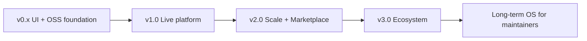
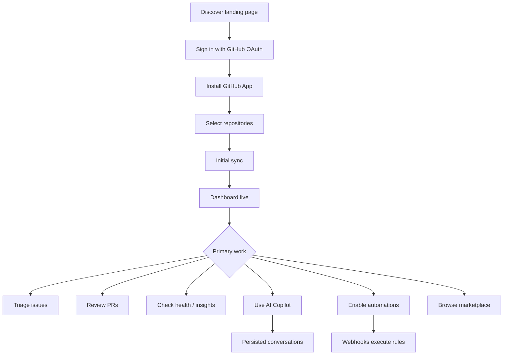
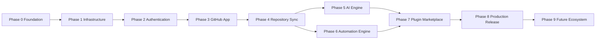
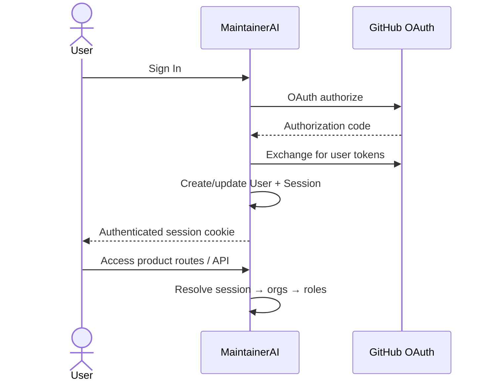
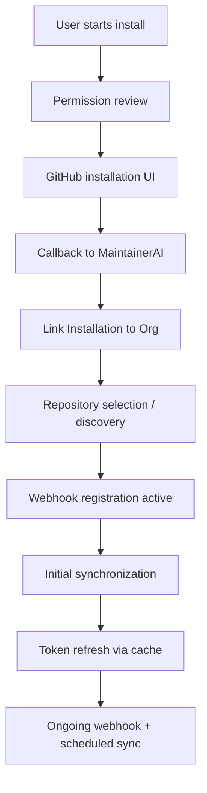
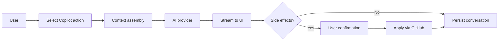
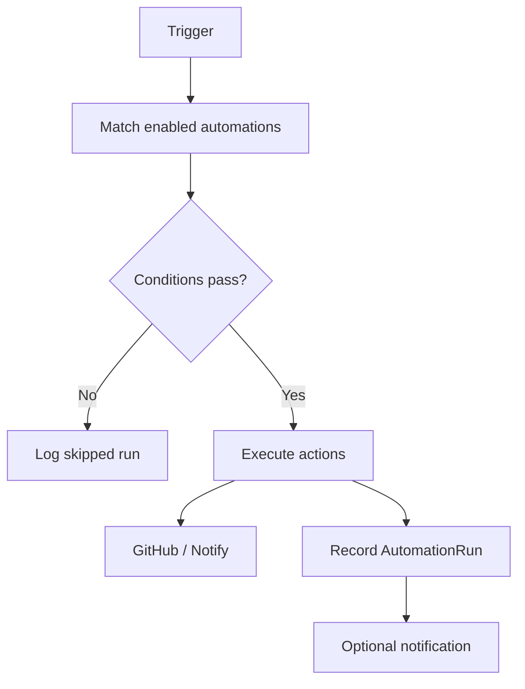

# MaintainerAI Product Specification

> **Single source of truth for what MaintainerAI is building.**
>
> Every contributor, maintainer, designer, developer, AI assistant, reviewer, and future collaborator should read this document before implementing any feature.
>
> This document defines **WHAT**. Implementation detail (**HOW**) lives in the architecture documents listed in [§22 Appendices](#22-appendices).
>
> **Status:** Living document · **Product version target:** v1.0 · **Last updated:** 2026-07-26  
> **Authority:** Derived from the repository as source of truth (`PROJECT_ANALYSIS.md`, `SYSTEM_ARCHITECTURE.md`, `DATABASE_DESIGN.md`, `API_SPECIFICATION.md`, `DEVELOPMENT_ROADMAP.md`, `README.md`, `ROADMAP.md`, `OPEN_SOURCE_AUDIT.md`, and the current frontend).

---

## Document control

| Item | Value |
| ---- | ----- |
| Product name | MaintainerAI |
| License | MIT |
| Primary users | Open-source maintainers, org admins, contributor communities |
| Current product stage | Frontend-complete prototype; backend not yet built |
| Production readiness (audit) | 3.2 / 10 — see `PROJECT_ANALYSIS.md` |
| Companion “how” docs | Architecture, Database, API, Development Roadmap |

**Change policy:** Product decisions that change scope, personas, acceptance criteria, or Definition of Done must update this document in the same PR as the decision. Architecture docs may change without a PRODUCT_SPEC update only when behavior and user-facing outcomes remain identical.

---

## 1. Executive Summary

### What MaintainerAI is

MaintainerAI is an **open-source, AI-powered operating system for GitHub maintainers**. It is a self-hostable control plane that helps individuals and organizations triage issues, review pull requests, measure repository health, understand contributors, and automate repetitive maintainer work—from a single command center that is **GitHub-native**.

GitHub remains the source of truth. MaintainerAI mirrors and enriches that data; it does not replace GitHub.

### Why it exists

Open-source maintainership does not scale with stars alone. Issues pile up, pull requests stall, contributor experience degrades, and maintainers burn out when their tools are fragmented: GitHub’s native UI, third-party bots, spreadsheets, chat threads, and ad-hoc scripts. MaintainerAI exists to give maintainers **one coherent product** designed for their workflow—not for general developer productivity or CI/CD.

### Vision

Become the open-source operating system for repository maintainers: an AI-native control plane that reduces triage burden, improves contributor experience, and keeps projects healthy at any scale—whether one library or hundreds of repositories across an organization.

### Mission

Make maintainership **sustainable, transparent, and community-owned** by shipping tooling that is open-source, self-hostable, extensible, and trustworthy.

### Long-term vision

Evolve from a dashboard into a full maintainer platform: GitHub App + web UI + AI engine + automation + plugin marketplace + public API + SDK + CLI + VS Code extension, with Self-Hosted, Cloud, and (later) Enterprise editions. See [§21 Future Vision](#21-future-vision).

### Core philosophy

1. **GitHub-native** — We integrate with GitHub; we do not fork the social model of open source.
2. **Self-hostable first** — The same stack that powers a personal install can power SaaS.
3. **UI already describes the product** — The current frontend and typed domain model are the product surface; the backend must fulfill them, not reinvent them.
4. **Assist, don’t replace** — AI and automation accelerate maintainers; humans retain merge and governance authority.
5. **Open by default** — MIT licensed; community governance; no dark patterns around data lock-in.

### Product principles

| Principle | Meaning |
| --------- | ------- |
| Clarity over cleverness | Maintainers should understand what the product did and why. |
| Least privilege | GitHub App and plugin permissions stay minimal. |
| Async by default | Heavy sync, AI, and automation never block the UI request path. |
| Provider-agnostic AI | Users choose OpenAI, Anthropic, Azure, or Ollama. |
| Additive engineering | Prefer wiring real data behind existing UI over redesigning UI. |
| Auditability | Mutations and bot actions leave a trail. |
| Accessibility | Long maintainer sessions demand readable, keyboard-friendly UI. |

### North Star

> A maintainer installs the GitHub App once, connects their repositories, and within minutes sees **live** health, issues, PRs, and contributors—then uses AI and automation to keep the project healthy without leaving MaintainerAI.

### Success metrics (summary)

See [§19 Success Metrics](#19-success-metrics) for the full set. Leading indicators for v1.0:

- Repositories successfully connected and syncing
- Issues and PRs managed through the product (not mock data)
- AI actions completed against real repository context
- Automation executions with measurable success rate
- Successful self-host deployments (`docker compose up`)
- Community health: stars, contributors, good-first-issue throughput

---

## 2. Problem Statement

### Problems by audience

#### Open-source maintainers

| Pain | Description |
| ---- | ----------- |
| Triage overload | High issue volume, duplicates, unclear priority, stale threads |
| Review bottleneck | Large PRs wait days; context switching kills review quality |
| Invisible health | No single score for docs debt, CI, backlog, contributor activity |
| Bot sprawl | Many bots with overlapping permissions and opaque behavior |
| Burnout | Maintainership feels endless and thankless |

#### Organizations

| Pain | Description |
| ---- | ----------- |
| Multi-repo chaos | Dozens of repos with inconsistent labels, automation, and ownership |
| No org-level view | Hard to see which projects are unhealthy or under-reviewed |
| Permission sprawl | Many apps and PATs with unclear blast radius |
| Compliance gaps | Weak audit trails for who changed what on behalf of the org |

#### Communities

| Pain | Description |
| ---- | ----------- |
| First-timer friction | Unclear how to claim issues or get help |
| Uneven recognition | Contributors who review or triage go unseen |
| Mentorship gaps | No structure for mentor/mentee pairing |

#### Hackathons

| Pain | Description |
| ---- | ----------- |
| Short-lived chaos | Many issues/PRs in a short window; triage collapses |
| Onboarding time | Participants waste hours figuring out repo norms |
| Judging blind spots | Organizers lack contributor and activity clarity |

#### Large GitHub repositories

| Pain | Description |
| ---- | ----------- |
| Scale | Thousands of issues/PRs; GitHub UI alone is insufficient |
| Signal vs noise | Critical bugs buried under feature requests and spam |
| Release complexity | Changelogs and release notes are manual and error-prone |

#### Developer teams

| Pain | Description |
| ---- | ----------- |
| Split tools | Slack + GitHub + spreadsheets + custom scripts |
| No shared workflow | Issue states beyond open/closed are informal |
| Review SLA gaps | Engineering managers cannot see merge readiness |

### Why current tools are insufficient

| Tool class | Gap |
| ---------- | --- |
| GitHub native UI | Excellent source of truth; weak as a *maintainer operating system* (health, multi-repo ops, AI triage, visual automation) |
| Generic project boards | Not GitHub-native enough; duplicate state; weak PR/code context |
| Single-purpose bots | Fragmented; hard to configure; limited analytics; opaque AI |
| ChatOps scripts | Brittle; unmaintained; no product UX or self-host story |
| Closed SaaS maintainer tools | May help, but conflict with self-host, open-source, and data-sovereignty needs |

MaintainerAI’s wedge: **one open, self-hostable product** that combines command-center UX, GitHub App integration, AI assist, and automation—aligned with how maintainers already work on GitHub.

---

## 3. Product Goal

### Ultimate goal

Make sustainable maintainership the default for open-source projects of every size by shipping MaintainerAI as the standard open-source maintainer platform.

### Version horizons

| Horizon | Goal |
| ------- | ---- |
| **v1.0** | Replace mocks with a real platform: OAuth, GitHub App, sync, health, AI copilot (12 actions), built-in automations, first-party plugins catalog, Docker self-host. UI stays; data becomes real. |
| **v2.0** | Hardened multi-org ops, richer AI agents, public API + API keys, expanded automation library, marketplace with community plugins (sandboxed), stronger observability and enterprise-ready self-host. |
| **v3.0** | Full ecosystem: TS SDK, CLI, VS Code extension, Cloud edition, Enterprise edition (SSO/SCIM, advanced policy), optional multi-provider VCS expansion only if community demand is proven. |
| **Long-term ecosystem** | MaintainerAI as infrastructure: plugins, agents, and integrations compose on a stable API the same way CI systems compose on GitHub. |

Implementation sequencing for v1.0 is detailed in `DEVELOPMENT_ROADMAP.md` (Milestones 1–8) and mirrored as product phases in [§8 Product Roadmap](#8-product-roadmap).

---

## 4. Target Users

### Persona summary

| Persona | Primary job | Relationship to product |
| ------- | ----------- | ----------------------- |
| Individual Maintainer | Keep 1–few repos healthy | Primary v1.0 user |
| Organization Admin | Connect org, manage installs & members | Primary v1.0 user |
| Project Owner | Own roadmap and release quality | Primary v1.0 user |
| Contributor | Find work, claim issues, get reviewed | Secondary (benefits via better UX) |
| Hackathon Organizer | Run short intensive contribution events | Secondary / stretch |
| Engineering Manager | Visibility into review SLAs and health | Secondary |
| Enterprise Team | Policy, audit, self-host at scale | Future (v2+) |

### 4.1 Individual Maintainer

| Dimension | Detail |
| --------- | ------ |
| **Goals** | Clear backlog, faster reviews, less repetitive commenting/labeling |
| **Responsibilities** | Triage, review, release, community care |
| **Pain points** | Context switching, stale issues, review fatigue |
| **Needs** | Live dashboard, AI triage/review, one-click automations, health score |

### 4.2 Organization Admin

| Dimension | Detail |
| --------- | ------ |
| **Goals** | Consistent hygiene across repos; controlled GitHub App permissions |
| **Responsibilities** | Install/uninstall App, member roles, org policies |
| **Pain points** | Shadow bots, uneven repo quality, no org roll-up |
| **Needs** | Org dashboard, installation management, audit log, role-based access |

### 4.3 Contributor

| Dimension | Detail |
| --------- | ------ |
| **Goals** | Find good first issues, claim work, get timely feedback |
| **Responsibilities** | Issues, PRs, reviews (sometimes) |
| **Pain points** | Unclear ownership, silent PRs, duplicate issues |
| **Needs** | Clear issue states, welcome automation, badges/recognition, suggested issues |

### 4.4 Project Owner

| Dimension | Detail |
| --------- | ------ |
| **Goals** | Ship healthy releases; attract and retain contributors |
| **Responsibilities** | Roadmap, governance, release notes, contributor experience |
| **Pain points** | Docs drift, release notes toil, unknown health risks |
| **Needs** | Insights, changelog/release-note AI, health trends, automation coverage |

### 4.5 Hackathon Organizer

| Dimension | Detail |
| --------- | ------ |
| **Goals** | High-quality contributions in a short window |
| **Responsibilities** | Repo prep, labeling, mentoring, judging inputs |
| **Pain points** | Flood of issues/PRs; chaotic claims |
| **Needs** | Fast onboarding automation, claim workflows, activity visibility |

### 4.6 Engineering Manager

| Dimension | Detail |
| --------- | ------ |
| **Goals** | Predictable review throughput and risk visibility |
| **Responsibilities** | Team allocation, process, quality gates |
| **Pain points** | Blind spots on merge readiness and PR age |
| **Needs** | Merge-readiness scores, activity timelines, contributor load |

### 4.7 Enterprise Team (future)

| Dimension | Detail |
| --------- | ------ |
| **Goals** | Self-host with SSO, policy, and compliance |
| **Responsibilities** | Security, procurement, platform ops |
| **Pain points** | SaaS data residency; bot permission sprawl |
| **Needs** | Air-gapped deploy, audit export, SCIM/SSO, SLA |

---

## 5. User Journeys

### Journey map (v1.0)

### 5.1 First-time user

1. Lands on marketing page (`/`).
2. Chooses **Get Started** / **Sign In** → onboarding.
3. Authenticates with GitHub OAuth.
4. Guided through App install, repo selection, optional automation setup.
5. Lands on `/dashboard` with live (post-sync) data.

**Acceptance:** User never needs to invent PATs manually for core v1.0 flows; App + OAuth cover access.

### 5.2 GitHub App installation

1. User opens `/install` or onboarding **Connect GitHub**.
2. Reviews required permissions (contents, issues, pull requests, workflows as documented).
3. Completes GitHub’s installation UI (user or org).
4. Callback links installation to MaintainerAI organization/tenant.
5. `/github-app` shows status, permissions, webhook health, rate-limit remaining.

### 5.3 Repository onboarding

1. User selects repositories (`/onboarding/select-repositories` or `/import`).
2. System enqueues sync jobs.
3. Repositories appear in `/repositories` with metadata, health, automation flags.
4. User opens Repository Command Center for a single repo.

### 5.4 Contributor management

1. User opens `/contributors`.
2. Views analytics (contributions, review/merge times, open PRs, issues solved).
3. Opens contributor profile (badges, strengths, suggested first issues, activity graph).
4. Optionally uses AI **Suggest Contributors** for an issue/PR.

### 5.5 Issue workflow

1. User opens `/issues`, filters by repo/state/priority/label.
2. Opens issue detail with extended workflow states:  
   `draft → open → claimed → in-progress → review → blocked → ready-to-merge → closed`.
3. Uses checklist, timeline, dependencies, AI suggestions (labels, related issues, assignees).
4. Actions write through to GitHub; webhooks reconcile local state.

### 5.6 Pull Request review

1. User opens `/pull-requests`.
2. Opens PR review screen: files, checks, CI, security/performance analysis, comments, merge readiness.
3. Requests or views **AI Review** (summary, findings, recommendation, confidence).
4. Approves / requests changes / merges via product (proxied to GitHub).

### 5.7 Repository monitoring

1. `/health` shows multi-dimensional health (code quality, docs, backlog, CI, automation coverage, security, dependencies).
2. `/insights` lists AI insights with severity, confidence, suggested action, quick-fix availability.
3. `/activity` shows cross-repo timeline.

### 5.8 AI Copilot

1. User opens panel (Ctrl/Cmd+I) or `/ai-generator`.
2. Starts or continues a conversation scoped to a repository when relevant.
3. Selects an action (12 defined in product) or free-form chat.
4. Receives streamed response; conversation persists across reloads.
5. May apply structured outputs (e.g., create issue, apply labels) with explicit confirmation.

### 5.9 Automation

1. User opens `/automation`.
2. Enables a built-in template or builds a workflow (trigger → conditions → actions).
3. Saves and enables.
4. GitHub events or schedules execute runs; UI shows runs and success rate.
5. Failures surface in notifications and run logs.

### 5.10 Plugin installation

1. User browses `/marketplace`.
2. Views plugin detail (purpose, permissions, version).
3. Installs for org and optionally scopes to a repository.
4. Configures and enables; capability appears in automations/AI/integrations as applicable.

### 5.11 Organization setup

1. Org Admin signs in; org membership resolved from GitHub.
2. Installs App on the organization.
3. Invites/manages roles (admin, maintainer, developer, viewer).
4. Uses org dashboard for roll-up health and activity.
5. Reviews audit log for sensitive actions.

---

## 6. Product Features

**Status key**

| Status | Meaning |
| ------ | ------- |
| Already Implemented | Shipped and usable as designed (typically UI/foundation with no mock dependency for that surface) |
| Partially Implemented | UI and domain model exist; behavior is mocked or non-persistent |
| Planned | Required for v1.0; not built |
| Future | Explicitly post-v1.0 |

**Priority:** P0 = v1.0 blocker · P1 = v1.0 important · P2 = stretch / early v1.x · P3 = future

**Owner:** Product area owner (role), not a person name.

### 6.1 Already Implemented

| Feature | Purpose | Description | Dependencies | Priority | Acceptance criteria | Owner |
| ------- | ------- | ----------- | ------------ | -------- | ------------------- | ----- |
| Design system & theming | Consistent UX | Token-driven UI, light/dark, shared primitives | None | P0 | Visual consistency across routes; theme toggle works | Design System |
| App shell & navigation | Product chrome | Sidebar, navbar, command palette, marketing vs app layout split | Design system | P0 | `/` is marketing; product routes use shell | Frontend |
| Marketing landing page | Acquisition | Hero, features, how-it-works, OSS story, FAQ, CTAs | Design system | P0 | Loads without app chrome; CTAs to onboarding/docs/GitHub | Growth / Frontend |
| Open-source foundation | Community trust | MIT, CoC, SECURITY, CONTRIBUTING, governance, issue/PR templates, CI | None | P0 | Repo meets OSS audit checklist | Maintainers |
| Docker / Dev Container / DX tooling | Contributor velocity | Dockerfile, Compose shell, ESLint/Prettier/Husky/Commitlint | Node 20 | P0 | `pnpm build` + documented local/Docker start | Platform |
| In-app documentation routes | Education | `/docs`, FAQ-oriented pages, `/deploy`, `/contribute` | Content | P1 | Docs reachable from product and marketing | Docs |

### 6.2 Partially Implemented

| Feature | Purpose | Description | Dependencies | Priority | Acceptance criteria | Owner |
| ------- | ------- | ----------- | ------------ | -------- | ------------------- | ----- |
| Dashboard | Command overview | Stats, activity, repo summary | Auth, Sync | P0 | Shows **live** user/org data post-sync | Product |
| Repository management | Multi-repo control | List, command center, import | GitHub App, Sync | P0 | Real repos; sync status accurate | Product |
| Issues | Triage | List + extended workflow model | Sync, GitHub writes | P0 | CRUD/transitions reflect GitHub | Product |
| Pull Requests | Review | List + AI-ready review detail UI | Sync, AI (for AI review) | P0 | Real PR data; merge readiness computed | Product |
| Contributors | Community insight | Analytics + profile | Sync | P0 | Metrics from real GitHub activity | Product |
| Health Center | Risk visibility | Multi-metric health UI | Health engine | P0 | Scores recompute on events/schedule | Product |
| AI Insights | Actionable alerts | Severity/confidence/quick-fix UI | AI + Health | P1 | Insights generated from real data | AI |
| Automation Center | Reduce toil | List + visual builder | Automation engine | P0 | Save/load/enable; runs are real | Automation |
| AI Copilot UI | Maintainer assist | Panel + 12 actions + generator page | AI backend | P0 | Streaming + persisted conversations | AI |
| GitHub App screen | Install ops | Status, permissions, webhooks, rate limit | GitHub App backend | P0 | Reflects real installation | Integrations |
| Onboarding / Install | Activation | Multi-step connect/select/setup | Auth + App | P0 | Completes with real OAuth/App | Product |
| Marketplace UI | Extensibility | Browse plugins | Plugin catalog | P1 | Catalog from API; install works for first-party | Marketplace |
| Settings UI | Configuration | Profile, notifications, AI, security, advanced | Auth + Settings API | P0 | Preferences persist | Product |
| Notifications UI | Attention | Inbox shapes in mock | Notifications service | P1 | Real events; read/unread | Product |
| Community / Releases / Integrations pages | Discovery | Community links, roadmap/releases surface, integrations | Content / APIs | P2 | Accurate links; no fake claims | Docs / Product |
| Admin page | Ops | Admin surface placeholder | Auth roles | P2 | Restricted to system/org admin when wired | Platform |

### 6.3 Planned (v1.0 backend platform)

| Feature | Purpose | Description | Dependencies | Priority | Acceptance criteria | Owner |
| ------- | ------- | ----------- | ------------ | -------- | ------------------- | ----- |
| Infrastructure | Substrate | Postgres, Redis, workers, env contract, health/ready | None | P0 | Compose brings up web+worker+db+redis; migrate runs | Platform |
| Authentication | Identity | GitHub OAuth, sessions, orgs, roles | Infrastructure | P0 | Sign-in/out; tenant isolation | Security |
| GitHub App + Webhooks | Access & events | Install lifecycle, tokens, HMAC webhooks | Auth | P0 | Verified webhooks; tokens refresh | Integrations |
| Repository Sync | Live data | Mirror repos, issues, PRs, contributors, releases | GitHub App | P0 | Dashboard no longer uses mocks | Sync |
| Health Scoring Engine | Monitoring | Compute & store health history | Sync | P0 | Matches product health dimensions | Product |
| AI Provider Layer | Intelligence | Provider-agnostic streaming AI + 12 actions | Sync | P0 | Each action works on real context | AI |
| Automation Engine | Execution | Triggers, conditions, actions, runs | Sync | P0 | Built-ins: auto-label, stale, welcome, issue-claim | Automation |
| Notifications backend | Alerts | Persist and deliver in-app notifications | Sync / Automation | P1 | Inbox matches events | Product |
| Audit log | Trust | Record mutations | Auth | P1 | Org admin can query recent actions | Security |
| First-party plugin catalog | Marketplace seed | Register built-in capabilities as plugins | AI + Automation | P1 | Install/enable/config for first-party | Marketplace |
| Observability & testing | Production readiness | Logging, errors, e2e core journeys | Platform | P0 | Release checklist green | Platform |
| Settings persistence | Control | AI provider prefs, notification prefs | Auth | P0 | Survives reload | Product |

### 6.4 Future (post-v1.0)

| Feature | Purpose | Description | Dependencies | Priority | Acceptance criteria | Owner |
| ------- | ------- | ----------- | ------------ | -------- | ------------------- | ----- |
| Sandboxed third-party plugins | Ecosystem | Signed manifests, capability tokens | Marketplace v1 | P3 | Untrusted code cannot exceed grants | Marketplace |
| Public REST API + API keys | Integration | Third-party access | v1 API | P3 | Key lifecycle; scoped access | Platform |
| TypeScript SDK | Embed | Typed client | Public API | P3 | Publishable package; docs | Ecosystem |
| CLI | Terminal/CI | `maintainerai` commands | Public API | P3 | Auth + health/triage/release commands | Ecosystem |
| VS Code extension | In-editor assist | Insights and actions in IDE | Public API | P3 | Install from marketplace; core actions | Ecosystem |
| Billing / plans | Monetization (optional) | Pricing marked “Soon” on marketing | Cloud edition | P3 | Explicitly out of v1.0 | Growth |
| Enterprise SSO/SCIM | Enterprise | Identity federation | Enterprise edition | P3 | Documented IdP flows | Enterprise |
| Multi-VCS | Expansion | Non-GitHub hosts | Proven demand | P3 | Not committed | Product |

---

## 7. Current Progress

Audit of the repository as of this specification. Evidence primarily from `PROJECT_ANALYSIS.md` and `OPEN_SOURCE_AUDIT.md`.

### Legend

| Status | Meaning |
| ------ | ------- |
| Completed | Shipped in repo and usable for its intended scope |
| In Progress | Actively being built (none for backend platform at spec time) |
| Not Started | Designed / planned; no production implementation |

### Completed

| Area | Evidence |
| ---- | -------- |
| Marketing landing page | `app/page.tsx`, `components/marketing/*` |
| Dashboard UI | `app/dashboard/page.tsx` |
| Repository / Issues / PRs / Contributors UIs | corresponding `app/*` routes + feature components |
| Health / Insights / Activity UIs | `app/health`, `app/insights`, `app/activity` |
| AI Copilot UI + AI Generator page | `components/copilot/*`, `hooks/use-copilot.ts`, `app/ai-generator` |
| Automation Center UI + builder | `app/automation`, `components/automation/automation-builder.tsx` |
| Marketplace / Community / Docs / Settings UIs | respective routes |
| Onboarding / Install / GitHub App UIs | respective routes (UI-only) |
| Design system | `components/ui`, `app/globals.css` |
| Open Source Foundation | LICENSE, governance, CI, templates — `OPEN_SOURCE_AUDIT.md` |
| GitHub Workflows | `.github/workflows/*` |
| Docker / Dev Container / VS Code | `Dockerfile`, Compose, `.devcontainer`, `.vscode` |
| Documentation set | `/docs/*`, README, ROADMAP |
| Architecture & planning docs | `PROJECT_ANALYSIS.md`, `SYSTEM_ARCHITECTURE.md`, `DATABASE_DESIGN.md`, `API_SPECIFICATION.md`, `DEVELOPMENT_ROADMAP.md`, this `PRODUCT_SPEC.md` |
| Domain type models | `lib/*-types.ts`, `lib/copilot-utils.ts`, `lib/mock-data.ts` |

### In Progress

| Area | Notes |
| ---- | ----- |
| — | No backend milestone is currently implemented; planning is complete |

### Not Started

| Area | Notes |
| ---- | ----- |
| Infrastructure (Postgres, Redis, workers) | Milestone 1 |
| Authentication | Milestone 2 |
| GitHub App + webhooks | Milestone 3 |
| Repository sync + health engine | Milestone 4 |
| AI backend / streaming | Milestone 5 |
| Automation execution engine | Milestone 6 |
| Marketplace backend / plugin installs | Milestone 7 |
| Production hardening / observability / e2e | Milestone 8 |
| SDK / CLI / VS Code / billing | Future |

### Progress snapshot

| Layer | Progress |
| ----- | -------- |
| Product UI surfaces | ~95% (mocked data) |
| Open-source & DX foundation | ~100% for Phase A scope |
| Product planning | ~100% for v1.0 design |
| Production backend | ~0% |
| End-to-end live product | ~0% |

---

## 8. Product Roadmap

Product phases align with `DEVELOPMENT_ROADMAP.md` milestones plus foundation and future ecosystem. Complexity and risk are product-facing estimates; engineering detail stays in the development roadmap.

### Phase 0 — Project Foundation

| | |
| --- | --- |
| **Objectives** | Establish trustworthy OSS project and product UI shell |
| **Deliverables** | Landing, dashboard UI, domain mocks, docs, CI, Docker, governance |
| **Dependencies** | None |
| **Exit criteria** | Lint/typecheck/build green; OSS audit complete; UI navigable end-to-end with mocks |
| **Complexity** | L (done) |
| **Risk** | Low |

### Phase 1 — Infrastructure

| | |
| --- | --- |
| **Objectives** | Backend substrate ready without changing UX |
| **Deliverables** | Database, cache/queue, worker process, env contract, health/ready |
| **Dependencies** | Phase 0 |
| **Exit criteria** | `docker compose` runs web+worker+Postgres+Redis; migrations apply; health endpoints pass |
| **Complexity** | L |
| **Risk** | Medium (ops complexity for contributors) |

### Phase 2 — Authentication

| | |
| --- | --- |
| **Objectives** | Real identity, sessions, tenancy, roles |
| **Deliverables** | GitHub OAuth login, org membership, settings profile wiring |
| **Dependencies** | Phase 1 |
| **Exit criteria** | User can sign in/out; unauthorized API access blocked; roles enforced on org resources |
| **Complexity** | L |
| **Risk** | High (security boundary) |

### Phase 3 — GitHub App

| | |
| --- | --- |
| **Objectives** | Install lifecycle and verified event ingress |
| **Deliverables** | App install UX live, token exchange, webhook receiver, App management screen live |
| **Dependencies** | Phase 2 |
| **Exit criteria** | Installation linked; signed webhooks accepted; rate-limit visible |
| **Complexity** | XL |
| **Risk** | High (permissions, secrets, GitHub constraints) |

### Phase 4 — Repository Sync

| | |
| --- | --- |
| **Objectives** | Live GitHub data in the command center |
| **Deliverables** | Sync workers, incremental webhooks, health engine, notifications seed |
| **Dependencies** | Phase 3 |
| **Exit criteria** | Dashboard/repos/issues/PRs/contributors/health show real data; mocks retired from those paths |
| **Complexity** | XL |
| **Risk** | High (rate limits, consistency) |

### Phase 5 — AI Engine

| | |
| --- | --- |
| **Objectives** | Real AI assistance on real context |
| **Deliverables** | Provider layer, streaming, 12 actions, persisted conversations, PR AI review, insights generation |
| **Dependencies** | Phase 4 |
| **Exit criteria** | Each Copilot action works against a connected repo; usage accounted |
| **Complexity** | XL |
| **Risk** | High (cost, quality, provider variance) |

### Phase 6 — Automation Engine

| | |
| --- | --- |
| **Objectives** | Automations execute for real events |
| **Deliverables** | Builder persistence, engine, built-in templates, run history |
| **Dependencies** | Phase 4 (parallelizable with Phase 5) |
| **Exit criteria** | Auto-label, stale, welcome, issue-claim work end-to-end with auditability |
| **Complexity** | XL |
| **Risk** | High (write amplification, misuse) |

### Phase 7 — Plugin Marketplace

| | |
| --- | --- |
| **Objectives** | First-party extensibility model |
| **Deliverables** | Catalog, install/config, integrations wiring |
| **Dependencies** | Phases 5–6 |
| **Exit criteria** | First-party plugins installable; permission model documented |
| **Complexity** | L |
| **Risk** | Medium |

### Phase 8 — Production Release

| | |
| --- | --- |
| **Objectives** | Ship MaintainerAI v1.0 publicly |
| **Deliverables** | Observability, security pass, e2e journeys, docs, release artifacts |
| **Dependencies** | Phases 1–7 |
| **Exit criteria** | Meets [§20 Definition of Done](#20-definition-of-done) |
| **Complexity** | L–XL |
| **Risk** | Medium |

### Phase 9 — Future Ecosystem

| | |
| --- | --- |
| **Objectives** | Expand surface area beyond the web app |
| **Deliverables** | Public API keys, SDK, CLI, VS Code, sandbox plugins, Cloud/Enterprise |
| **Dependencies** | Phase 8 |
| **Exit criteria** | Separate product decisions; not required for v1.0 |
| **Complexity** | XL+ |
| **Risk** | Variable |

---

## 9. Functional Requirements

Requirements describe **behavior and outcomes**. API shapes and storage live in companion docs.

### 9.1 Landing

- Present MaintainerAI value proposition, features, OSS posture, and CTAs.
- Must not require authentication.
- Must encourage: install App, read docs, self-host, contribute on GitHub.
- Pricing may be labeled coming soon; must not claim live billing.

### 9.2 Dashboard

- Show aggregated stats across connected repositories (issues, PRs, resolution times).
- Show recent activity and high-signal AI suggestions.
- Empty states must guide unconnected users to onboarding.

### 9.3 GitHub App

- Display installation status, permissions, subscribed webhook events, sync status, rate-limit remaining.
- Support install, reconnect, sync trigger, and disconnect flows.
- Fail closed if webhook signatures are invalid.

### 9.4 Repository Management

- List, search/filter, import/connect, disconnect repositories.
- Repository Command Center: health, open issues/PRs, automation status, collaborators/topics.
- Respect private/public visibility and installation scope.

### 9.5 Issue Management

- List/filter issues; open extended detail.
- Support workflow states beyond GitHub’s open/closed (product states mapped onto GitHub labels/metadata as designed in engineering docs).
- Support labels, assignees, checklist, timeline, dependencies, comments.
- AI assists (labels, duplicates, related items) require confirmation before writes.

### 9.6 PR Review

- List/filter PRs; show review detail including files, checks, CI, comments.
- Show merge-readiness score with blockers/warnings/suggestions.
- Support AI review summary and human review actions.
- Support merge when permitted.

### 9.7 Automation

- List automations with enabled state, runs, success rate, last execution.
- Visual builder: triggers (issue created, PR opened, issue labeled, schedule), conditions, actions (label, assign, comment, notify).
- Built-in templates required for v1.0: auto-label, stale issues, welcome message, issue claim.
- Every run must be logged and attributable.

### 9.8 Contributor Analytics

- Per-repo contributor list and profiles.
- Metrics: contributions, issues/PRs, review/merge times, badges, activity by month, optional mentor status.
- Leaderboard view.

### 9.9 Repository Health

- Multi-dimensional scores matching the Health Center UI.
- History/trends and last measured time.
- Recompute on relevant events and on a schedule.

### 9.10 AI Copilot

Must support these actions (product surface already defined):

1. Repository Chat  
2. Ask Repository  
3. Generate Issue  
4. Review PR  
5. Explain Code  
6. Generate Labels  
7. Generate Documentation  
8. Generate Changelog  
9. Suggest Contributors  
10. Find Duplicates  
11. Generate Roadmap  
12. Generate Release Notes  

Cross-cutting AI requirements:

- Streaming responses in the panel.
- Persisted conversations (pin/delete/rename).
- Repository scoping when relevant.
- Provider selectable via settings/env (OpenAI, Anthropic, Azure, Ollama).
- Explicit user confirmation for side-effecting outputs (create issue, label, comment).

### 9.11 Marketplace

- Browse categories and plugin details.
- Install/enable/configure first-party plugins in v1.0.
- Show required permissions clearly before install.

### 9.12 Community

- Surface docs, discussions, roadmap, release notes, contribution paths.
- No fabricated testimonials or fake company names.

### 9.13 Documentation

- Installation, Docker, GitHub App, configuration, development, deployment, FAQ, architecture.
- Must stay accurate as backend lands (update in same milestone as behavior).

### 9.14 Organization Dashboard

- Org-level roll-up of repositories, health, members, and activity.
- Member role management for admins.

### 9.15 Notifications

- In-app inbox for PR merged, issue assigned, review requested, automation, system events.
- Unread counts; mark one/all read; dismiss.

### 9.16 Settings

- Profile, notification preferences, integrations, AI settings, security, advanced.
- Changes persist and apply without redeploy (except env-only secrets on self-host).

### 9.17 Self Hosting

- One documented path: Docker Compose with web, worker, Postgres, Redis.
- Health/readiness probes.
- Backup/restore and upgrade guidance for v1.0 release.

### 9.18 Admin

- System/org admin surfaces for installation health, audit review, and operational toggles.
- Must not be accessible to unauthorized roles.

---

## 10. Non-Functional Requirements

| Area | Requirement |
| ---- | ----------- |
| **Performance** | Interactive pages usable on typical maintainer hardware; AI streaming first token promptly under normal provider latency; sync/AI/automation never block HTTP request threads |
| **Scalability** | Queue-backed webhook and sync processing; multi-repo orgs supported without synchronous fan-out in request path |
| **Availability** | Self-host: documented recovery; Cloud (future): target high availability separately |
| **Accessibility** | Keyboard navigation, focus visibility, reduced-motion respect, semantic structure; WCAG-oriented audit before v1.0 |
| **Security** | OAuth sessions; installation-scoped authz; webhook HMAC; secrets via env; least privilege; audit mutations; rate limits |
| **Reliability** | Idempotent webhook handling; retries with backoff for jobs; graceful AI provider failure messages |
| **Maintainability** | Stable design system; typed domain; planning docs as contracts; no drive-by UI redesigns |
| **Observability** | Structured logs, error tracking, queue/rate-limit metrics, correlation IDs |
| **Internationalization** | English-first in v1.0; structure UI strings for future i18n without committing to full localization |
| **Offline support** | Not required for v1.0 (online product); graceful degradation when GitHub/AI unavailable |
| **Caching** | Cache GitHub reads and computed health; invalidate on webhooks/schedule |
| **Logging** | Structured JSON logs for API, webhooks, workers |
| **Testing** | Unit + integration for auth/sync/webhooks; e2e for core journeys before v1.0 |

---

## 11. Authentication Flow

### Product rules

- **GitHub OAuth** identifies the human user (who is logged in).
- **Sessions** are server-backed and HTTP-only; logout invalidates them.
- **Organizations** are tenancy boundaries (personal namespace or GitHub org).
- **Repository permissions** in-product are constrained by GitHub App installation scope **and** membership role.
- **User roles** (product): `admin`, `maintainer`, `developer`, `viewer` (see [§16](#16-permission-model)).
- OAuth user tokens and App installation tokens are distinct; the product must never conflate them in UX copy.

---

## 12. GitHub App Flow

### Product requirements

| Step | Outcome |
| ---- | ------- |
| Installation | User/org can install and see success or clear failure |
| Permission review | Permissions explained in product language before redirect |
| Repository selection | User chooses all or subset of accessible repos |
| Webhook registration | Events required for sync/automation are active |
| Synchronization | Progress visible; failures actionable |
| Token refresh | Transparent to user; rate limit visible on App page |
| Repository discovery | New repos on installation can be imported later |

---

## 13. Repository Sync Flow

### What syncs (v1.0)

| Domain | Product expectation |
| ------ | ------------------- |
| Repository import | Connect repos from installation |
| Metadata | Name, description, visibility, language, stars/forks, topics |
| Issues | Bodies, labels, assignees, comments count, state mapping |
| PRs | Metadata, files, checks, reviews, CI status |
| Contributors | Identity + per-repo analytics |
| Commits | As needed for activity/health (not a full VCS mirror) |
| Releases | Enough for health/release insights and notes generation |
| Branches | Minimal (default branch / protection signals if required for merge readiness) |
| Caching | Prefer cache + webhook invalidation over constant refetch |
| Background sync | Full and incremental jobs; user-triggerable resync |

**Non-goal:** MaintainerAI is not a Git forge or full git object store.

---

## 14. AI Workflow

### How AI works (product view)

1. User selects an action or asks a question.
2. Product gathers **allowed** repository context (issues/PRs/docs metadata as scoped).
3. Provider generates a response (streamed).
4. Conversation and usage are stored.
5. If the output implies a GitHub write, user confirms before apply.

### Capability map

| Capability | User outcome |
| ---------- | ------------ |
| Repository Chat / Ask Repository | Answers grounded in repo context |
| Issue Generator | Drafts structured issues |
| PR Review | Summary, findings, recommendation |
| Repository Health / Insights | Explains risks and suggested actions |
| Documentation / Changelog / Release Notes / Roadmap | Drafts maintainer artifacts |
| Label Suggestions | Proposed labels with confidence |
| Contributor Suggestions | Who might help |
| Find Duplicates | Candidate duplicate issues |
| Future AI Agents | Multi-step maintainer agents (post-v1.0) |

---

## 15. Automation Workflow

### Product components

| Component | Requirement |
| --------- | ----------- |
| Workflow Builder | Visual node editor; save/load/enable |
| Triggers | Issue created, PR opened, issue labeled, schedule |
| Conditions | Has label, author match, files match (extensible) |
| Actions | Add labels, assign, comment, notify |
| Execution | Async, rate-limit aware, idempotent where possible |
| Retries | Bounded retries with visible failure state |
| Notifications | User-visible on important failures/successes |
| Logs | Per-run history with status and detail |

---

## 16. Permission Model

### Product roles

| Role | Can do (summary) |
| ---- | ---------------- |
| **Guest** | View marketing and public docs only |
| **Contributor** (product viewer/developer as applicable) | View connected repo data per membership; limited writes |
| **Maintainer** | Triage, review, manage automations on granted repos |
| **Organization Admin** | Manage members, installation, org settings, audit |
| **System Admin** | Instance-level ops (self-host); not a normal org member role |
| **GitHub App** | Acts with installation permissions on GitHub; all App actions must be auditable |
| **API** (future) | Scoped by API key grants |
| **Plugin** | Only capabilities declared and granted at install time |

### Principles

- Deny by default.
- Installation scope is a hard ceiling (cannot exceed GitHub grants).
- Membership role further restricts in-product actions.
- Plugins cannot silently escalate.

Detailed endpoint authorization belongs in `API_SPECIFICATION.md` / `SYSTEM_ARCHITECTURE.md`.

---

## 17. Plugin Architecture

### Lifecycle (product)

1. **Discover** in Marketplace  
2. **Review** permissions and version  
3. **Install** (org and optional repo scope)  
4. **Configure**  
5. **Enable / Disable**  
6. **Update** (versioning)  
7. **Uninstall**

### v1.0 vs future

| Concern | v1.0 | Future |
| ------- | ---- | ------ |
| Authors | First-party only | Community |
| Runtime | Capability registry (AI/automation as plugins) | Sandboxed execution |
| Marketplace | Catalog + install UI | Signed distribution |
| SDK | Not required | Required for third parties |

---

## 18. Error Handling

### Error categories (user-facing)

| Category | Examples | User expectation |
| -------- | -------- | ---------------- |
| Validation | Missing fields, invalid state transition | Clear field messages; no silent drop |
| Authentication | Session expired | Prompt to sign in |
| Authorization | No installation / insufficient role | Explain what’s missing |
| GitHub | Rate limit, permission denied, outage | Actionable retry / wait guidance |
| AI | Provider error, timeout, budget | Non-blocking message; conversation preserved |
| Database | Persistence failure | Generic safe error; ops alert |
| Network | Offline / DNS | Retry affordance |
| User errors | Confirm declined, conflicting edits | Preserve draft where possible |

### Recovery strategy (product)

- Prefer **retry** for transient GitHub/network failures.
- Prefer **reconcile** via webhooks after partial writes.
- Prefer **preserve user input** on AI/UI failures.
- Never expose secrets or raw stack traces to end users.

---

## 19. Success Metrics

### Product metrics (v1.0)

| Metric | Why it matters |
| ------ | -------------- |
| Repositories connected | Activation |
| Issues managed through product | Core workflow adoption |
| PR reviews (human + AI-assisted) | Review value |
| AI requests / successful actions | Copilot usefulness |
| Automation executions + success rate | Toil reduction |
| Contributor growth on connected repos | Community outcome (lagging) |
| Time-to-first-value (install → live dashboard) | Onboarding quality |
| Self-host successful installs | OSS distribution health |

### Community metrics

| Metric | Why it matters |
| ------ | -------------- |
| GitHub stars | Awareness |
| Downstream clones / Docker pulls | Adoption |
| Unique contributors to MaintainerAI | Project health |
| Good first issues completed | Contributor funnel |

### Quality metrics

| Metric | Why it matters |
| ------ | -------------- |
| Webhook processing success rate | Reliability |
| Sync lag | Data freshness |
| Authz denial correctness (tests) | Security |
| e2e journey pass rate | Release readiness |

---

## 20. Definition of Done

### MaintainerAI v1.0 must include

- [ ] GitHub OAuth sign-in and session logout
- [ ] GitHub App install, callback linking, and management screen with live status
- [ ] Verified webhook ingestion and idempotent processing
- [ ] Repository connect/import and background sync for repos, issues, PRs, contributors
- [ ] Live Dashboard, Repositories, Issues, PRs, Contributors, Health, Activity (no mocks on these paths)
- [ ] Health scoring with persisted measurements
- [ ] AI Copilot streaming + persisted conversations
- [ ] All 12 Copilot actions functional against real repository context (with confirmation for writes)
- [ ] Automation builder save/load/enable
- [ ] Built-in automations: auto-label, stale issues, welcome, issue-claim
- [ ] Notifications for core events
- [ ] Settings persistence (profile, notifications, AI)
- [ ] First-party marketplace catalog with install/enable for built-in capabilities
- [ ] Docker Compose self-host: web + worker + Postgres + Redis + migrations
- [ ] Health/readiness endpoints
- [ ] Structured logging + error tracking baseline
- [ ] Automated tests covering auth, webhook signature failure, and core e2e journey
- [ ] Documentation updated for real setup (App, env, AI providers, self-host)
- [ ] SECURITY/disclosure process remains valid for production surface

### Explicitly out of scope for v1.0

- [ ] Billing / paid plans
- [ ] Third-party sandboxed plugin runtime
- [ ] Public API keys for external developers (seed UI/docs only if non-blocking)
- [ ] TypeScript SDK, CLI, VS Code extension as release blockers
- [ ] SSO/SCIM / Enterprise edition
- [ ] Non-GitHub VCS providers
- [ ] Full offline mode
- [ ] Full i18n localization
- [ ] Redesign of the existing design system or marketing/product UI (unless accessibility/security requires it)
- [ ] Replacing GitHub as the source of truth

---

## 21. Future Vision

MaintainerAI should evolve into a coherent **maintainer ecosystem**:

| Surface | Role |
| ------- | ---- |
| **GitHub App** | Access, events, and write-back |
| **AI Platform** | Provider-agnostic maintainer intelligence and agents |
| **Plugin Marketplace** | Community and first-party extensions |
| **CLI** | Automation in terminals and CI |
| **SDK** | Embed MaintainerAI in other tools |
| **REST API** | Stable integration contract |
| **VS Code Extension** | In-editor maintainer assistance |
| **Enterprise Edition** | SSO, policy, compliance, support |
| **Self-Hosted Edition** | Data sovereignty via Compose/Helm |
| **Cloud Edition** | Hosted multi-tenant convenience |

The web command center remains the heart of the product; other surfaces are clients of the same capabilities.

---

## 22. Appendices

### Glossary

| Term | Definition |
| ---- | ---------- |
| **Installation** | A GitHub App install granting MaintainerAI access to repos |
| **Sync** | Background mirroring of GitHub data into MaintainerAI |
| **Health score** | Composite repository health indicator shown in product |
| **Copilot action** | One of the 12 named AI capabilities |
| **Automation run** | A single execution of an automation graph |
| **Command center** | Per-repository operational view |
| **Tenant / Organization** | Access boundary for users and repos |
| **Write-through** | Product mutation that also updates GitHub |
| **First-party plugin** | Official MaintainerAI-provided capability packaged as a plugin |

### Terminology conventions

- Prefer **repository** over “project” when meaning a GitHub repo.
- Prefer **maintainer** for the primary user; **contributor** for participants.
- Prefer **GitHub App** over “bot” in user-facing security/permission contexts.
- Prefer **self-host** over “on-prem” unless discussing enterprise data centers specifically.

### Architecture references (HOW)

| Document | Use when |
| -------- | -------- |
| [`PROJECT_ANALYSIS.md`](./PROJECT_ANALYSIS.md) | Current state, gaps, risks, production score |
| [`SYSTEM_ARCHITECTURE.md`](./SYSTEM_ARCHITECTURE.md) | Runtime architecture, queues, AI/automation engines |
| [`DATABASE_DESIGN.md`](./DATABASE_DESIGN.md) | Schema, ER diagram, indexes |
| [`API_SPECIFICATION.md`](./API_SPECIFICATION.md) | REST endpoints and contracts |
| [`DEVELOPMENT_ROADMAP.md`](./DEVELOPMENT_ROADMAP.md) | Engineering milestones, files, complexity |
| [`ROADMAP.md`](./ROADMAP.md) | Public-facing roadmap narrative |
| [`OPEN_SOURCE_AUDIT.md`](./OPEN_SOURCE_AUDIT.md) | OSS foundation audit |
| [`docs/architecture.md`](./docs/architecture.md) | Contributor-oriented architecture overview |
| [`README.md`](./README.md) | Project entrypoint |

### Repository conventions

- Do not redesign UI/design system while wiring backend unless required for a11y/security.
- Replace `lib/mock-data.ts` usage incrementally; do not leave silent fake data on “live” paths after Phase 4 exit.
- Conventional Commits; PR template checklist required.
- Product scope changes update **this** document in the same PR.

### Product route inventory (current UI)

| Route | Product area |
| ----- | ------------ |
| `/` | Landing |
| `/dashboard` | Dashboard |
| `/repositories` | Repository management |
| `/issues` | Issues |
| `/pull-requests` | PRs |
| `/contributors` | Contributors |
| `/health` | Health |
| `/insights` | AI insights |
| `/automation` | Automation |
| `/ai-generator` | AI generator |
| `/github-app` | GitHub App |
| `/activity` | Activity |
| `/marketplace` | Marketplace |
| `/integrations` | Integrations |
| `/settings` | Settings |
| `/onboarding/**` | Onboarding |
| `/install` | Install |
| `/import` | Import |
| `/community`, `/docs`, `/contribute`, `/deploy`, `/releases` | Community & docs |
| `/admin` | Admin |
| `/license`, `/code-of-conduct` | Legal / community policy pages |

---

## Project Status Dashboard

| Category | Status | Progress |
| -------- | ------ | -------: |
| Landing Page | ✅ Complete | 100% |
| Dashboard UI | ✅ Complete | 100% |
| Repository / Issues / PRs / Contributors UI | ✅ Complete | 100% |
| Health / Insights / Activity UI | ✅ Complete | 100% |
| AI Copilot UI | ✅ Complete | 100% |
| Automation Center UI | ✅ Complete | 100% |
| Marketplace UI | ✅ Complete | 100% |
| Community / Docs / Settings UI | ✅ Complete | 100% |
| Onboarding / Install UI | ✅ Complete | 100% |
| Open Source Foundation | ✅ Complete | 100% |
| GitHub Workflows / Docker / DX | ✅ Complete | 100% |
| Architecture & Planning | ✅ Complete | 100% |
| Product Specification (`PRODUCT_SPEC.md`) | ✅ Complete | 100% |
| Infrastructure | ⏳ Planned | 0% |
| Authentication | ⏳ Planned | 0% |
| GitHub App (backend) | ⏳ Planned | 0% |
| Repository Sync | ⏳ Planned | 0% |
| AI Backend | ⏳ Planned | 0% |
| Automation Engine | ⏳ Planned | 0% |
| Marketplace Backend | ⏳ Planned | 0% |
| Production Release (v1.0) | ⏳ Planned | 0% |
| Future Ecosystem (SDK / CLI / VS Code) | 🧭 Future | 0% |

**Overall product readiness:** UI and planning are complete; the live platform (auth → App → sync → AI → automation → release) is **not started**. Next execution step: **Phase 1 — Infrastructure** (`DEVELOPMENT_ROADMAP.md` Milestone 1).

---

*End of Product Specification. When in doubt about what to build, this document wins. When in doubt about how to build it, consult the architecture suite.*
