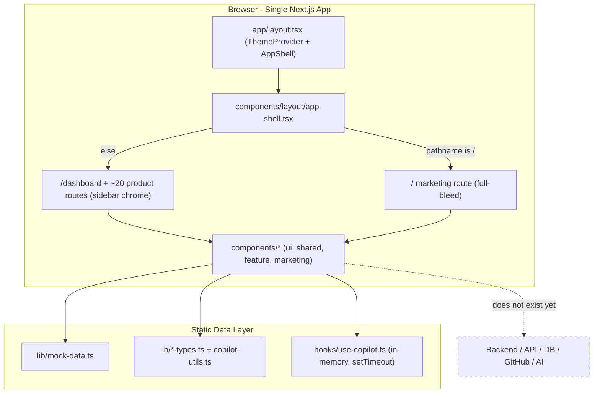

# MaintainerAI — Project Analysis

> Production readiness audit prepared by the Lead Engineering role.
> Scope: entire repository as of this audit. Evidence-based; no features implemented.

## 1. Executive Summary

MaintainerAI is a **frontend-complete, backend-absent** product. It ships a polished Next.js 16 (App Router) application with a mature design system, ~30 routes, a marketing site, and a full dashboard for repository management, issues, pull requests, contributors, automation, AI copilot, insights, and a marketplace.

**Every data-bearing surface is driven by static mock data** in [`lib/mock-data.ts`](lib/mock-data.ts) and typed fixtures in [`lib/`](lib). There is no API layer, database, authentication, GitHub integration, AI integration, background processing, testing, or observability. The AI copilot "streams" via a `setTimeout` in [`hooks/use-copilot.ts`](hooks/use-copilot.ts).

The work ahead is to build the **entire backend and integration platform** beneath a UI that already defines the domain model with unusual clarity. The typed fixtures are effectively a product spec.

**Overall Production Score: 3.2 / 10** (see [Section 18](#18-overall-production-score)).

## 2. Current Architecture



**Rendering model:** Almost all product pages are Client Components (`'use client'`), importing mock data directly at module scope. There is no server data fetching, no `route.ts` handlers, no server actions, and no `app/api` directory. State is ephemeral React state; nothing persists across reloads.

## 3. Folder Structure (as-is)

```text
maintainer-ai-ui-build/
├── app/                         # 30 routes, App Router
│   ├── layout.tsx               # Root layout, ThemeProvider, metadata, AppShell
│   ├── page.tsx                 # Marketing landing page
│   ├── dashboard/               # Product dashboard (moved from /)
│   ├── repositories/ issues/ pull-requests/ contributors/
│   ├── health/ insights/ automation/ ai-generator/ activity/
│   ├── github-app/ integrations/ marketplace/ import/ admin/
│   ├── releases/ settings/ community/ contribute/ deploy/ docs/
│   ├── code-of-conduct/ license/ install/
│   └── onboarding/{,, connect-github, select-repositories, setup-automation, complete}
├── components/
│   ├── ui/                      # 7 primitives (button, card, badge, input, select, tabs, textarea) on @base-ui/react
│   ├── shared/                  # 14 reusable widgets (health-badge, repository-table, command-palette, ...)
│   ├── layout/                  # sidebar, navbar, app-shell
│   ├── marketing/               # 12 landing sections
│   ├── automation/              # automation-builder (visual node editor)
│   ├── contributors/ copilot/ issues/ organization/ pr-review/ repository/
├── hooks/                       # use-copilot.ts (only hook)
├── lib/                         # mock-data.ts + 4 type modules + utils.ts (cn)
├── docs/                        # 10 guides (install, docker, github-app, deployment, ...)
├── public/                      # icons + placeholder assets
├── scripts/                     # sync-labels.mjs
├── .github/                     # workflows, issue/PR templates, dependabot, labels
├── Dockerfile, docker-compose.yml, .devcontainer/
├── package.json, tsconfig.json, next.config.mjs, eslint.config.mjs
└── README, CONTRIBUTING, SECURITY, GOVERNANCE, ROADMAP, CHANGELOG, ...
```

**Notable absences:** no `app/api/`, no `server/`, no `prisma/`, no `tests/`, no `.env` usage beyond `NEXT_PUBLIC_APP_URL`, no data-access layer, no auth config.

## 4. Technology Stack (verified)

| Layer | Technology | Evidence |
| ----- | ---------- | -------- |
| Framework | Next.js 16.2.6 (App Router, Turbopack) | `package.json`, build output |
| Language | TypeScript 5.7.3 (`strict: true`) | `tsconfig.json` |
| UI runtime | React 19 | `package.json` |
| Styling | Tailwind CSS 4, `tw-animate-css`, `shadcn/tailwind.css` | `app/globals.css` |
| Primitives | `@base-ui/react`, `class-variance-authority` | `components/ui/*` |
| Icons | `lucide-react` | throughout |
| Theming | `next-themes` (system/light/dark) | `app/layout.tsx` |
| Analytics | `@vercel/analytics` (prod only) | `app/layout.tsx` |
| Package manager | pnpm 9 | `package.json`, lockfile |
| Lint/format | ESLint 9 flat config, Prettier 3, markdownlint | `eslint.config.mjs` |
| Git hygiene | Husky, lint-staged, Commitlint (Conventional Commits) | `.husky/`, `commitlint.config.js` |
| Containers | Docker (standalone), Compose, Dev Container | `Dockerfile`, `docker-compose.yml` |
| CI | GitHub Actions (ci, build, lint, typecheck, codeql, ...) | `.github/workflows/` |

**Backend/runtime dependencies present:** none (no ORM, no HTTP client, no auth lib, no queue, no DB driver, no Octokit, no AI SDK).

## 5. Domain Model Encoded in the UI

The mock fixtures and type modules are a de-facto specification. Entities already modeled in TypeScript:

- **Repository** — [`lib/mock-data.ts`](lib/mock-data.ts): stars, forks, openIssues/PRs, language, healthScore, automation counters, collaborators, topics, isPrivate.
- **Issue** (basic + extended) — [`lib/issue-workflow-types.ts`](lib/issue-workflow-types.ts): 8-state workflow (`draft → open → claimed → in-progress → review → blocked → ready-to-merge → closed`), difficulty, dependencies, timeline, checklist, AI suggestions.
- **PullRequest** (basic + review detail) — [`lib/pr-review-types.ts`](lib/pr-review-types.ts): changed files, checks, CI status, coverage, breaking changes, security/performance analysis, AI review summary, merge-readiness scoring.
- **Contributor** — [`lib/contributor-types.ts`](lib/contributor-types.ts): analytics, badges, strengths, mentorship graph.
- **RepositoryHealth**, **AIInsight**, **Automation/AutomationWorkflow** (visual node graph), **Notification**, **TeamMember**, **GitHubApp installation**, **CopilotConversation/Message** — all typed.

This clarity substantially de-risks database and API design (see `DATABASE_DESIGN.md`, `API_SPECIFICATION.md`).

## 6. Strengths

1. **Design system maturity** — token-driven (`oklch` palette in `app/globals.css`), CVA variants, consistent primitives. Do not disturb.
2. **Domain modeling** — typed fixtures cover nearly every entity and state machine the backend must serve.
3. **Repository hygiene** — MIT license, governance, security policy, issue/PR templates, Dependabot, CodeQL, Docker, Dev Container already in place.
4. **Build health** — `pnpm lint`, `typecheck`, and `build` pass cleanly; 32 routes prerender as static.
5. **Clear route taxonomy** — product surfaces map cleanly onto future API resources.
6. **Standalone Docker output** — deployment substrate exists.

## 7. Weaknesses

1. **No backend of any kind** — the product does nothing real; all reads are static, all writes are discarded.
2. **Client-only data coupling** — pages import `mock-data` at module scope, so introducing server data requires refactoring each route's data source (not its markup).
3. **`typescript.ignoreBuildErrors: true`** in [`next.config.mjs`](next.config.mjs) — type errors cannot fail the production build. Dangerous once real code lands.
4. **`images.unoptimized: true`** — disables Next image optimization globally.
5. **No environment contract** — `.env.example` documents GitHub/AI vars, but nothing reads them.
6. **No persistence for copilot** — conversations vanish on reload; "streaming" is a timer.
7. **No tests** — zero unit, integration, or e2e coverage.

## 8. Missing: Backend

There is **no server application**. Required: an API layer (Next.js Route Handlers and/or a dedicated service), a data-access layer, domain services (repository sync, health scoring, automation execution, AI orchestration), and a worker runtime for async jobs. None exist.

## 9. Missing: APIs

No `app/api/` directory, no `route.ts`, no server actions, no REST/GraphQL surface. The UI never performs `fetch` to a first-party endpoint. All CRUD is simulated. Full target surface is designed in `API_SPECIFICATION.md`.

## 10. Missing: Database

No ORM, schema, migrations, or connection layer. Entities live only as TypeScript fixtures. No persistence, no relations enforced, no indexes. Target schema (PostgreSQL + Prisma) is designed in `DATABASE_DESIGN.md`.

## 11. Missing: Authentication

No auth library, session, cookie, JWT, or GitHub OAuth. `/onboarding/connect-github` and `/install` are UI-only flows. There is no notion of a signed-in user, tenant, or authorization boundary. `Sign In` links route to `/onboarding` with no backend.

## 12. Missing: GitHub Integration

No Octokit, GitHub App JWT signing, installation-token exchange, webhook receiver, or signature verification. `mockGitHubApp` describes the desired installation shape (permissions, webhook events, rate limit) but nothing calls GitHub. Repository/issue/PR data is fabricated.

## 13. Missing: AI Integration

No provider SDK (OpenAI/Anthropic/Azure/Ollama), no prompt layer, no streaming transport (SSE/Web Streams), no token accounting, no retrieval/context building. `.env.example` lists `AI_PROVIDER`/`AI_API_KEY`/`AI_MODEL`, but [`hooks/use-copilot.ts`](hooks/use-copilot.ts) returns a canned string after `setTimeout(1000)`. The 12 `CopilotAction`s in [`lib/copilot-utils.ts`](lib/copilot-utils.ts) define the AI capability surface.

## 14. Missing: Background Workers

No queue (BullMQ/Redis), scheduler, or worker process. Automation "runs"/"successRate" are static numbers. Repository sync, webhook processing, health recomputation, stale-issue sweeps, and scheduled automations all require async infrastructure that does not exist.

## 15. Missing: Testing, Monitoring, Logging, Deployment Features

- **Testing** — no test runner, no unit/integration/e2e, no fixtures-as-tests, no coverage gate. CI runs lint/typecheck/build only.
- **Monitoring** — no error tracking (Sentry), metrics, tracing, or health/readiness endpoints for the app itself.
- **Logging** — no structured logger; nothing to log yet.
- **Deployment features** — Docker/Compose exist, but no DB/Redis services in compose, no migration step, no secrets management, no readiness/liveness probes wired to real dependencies, no CD pipeline.

## 16. Technical Debt

| Item | Location | Severity |
| ---- | -------- | -------- |
| `ignoreBuildErrors: true` | `next.config.mjs` | High |
| `images.unoptimized: true` | `next.config.mjs` | Medium |
| Numeric mock IDs (`1,2,3`) will not match GitHub IDs / UUIDs | `lib/mock-data.ts` | Medium (schema pivot needed) |
| Mock data imported at module scope in client pages | `app/**/page.tsx` | Medium (data-source refactor) |
| Duplicated inline entity shapes vs. type modules | `mock-data.ts` vs `lib/*-types.ts` | Low |
| Copilot state non-persistent, fake streaming | `hooks/use-copilot.ts` | Low (expected pre-backend) |
| `generator: 'v0.app'` metadata leftover | previously in layout | Low |

## 17. Risk Assessment

### Performance Risks
- All product pages are client-rendered and would fetch on the client once wired; without server components / caching this creates waterfalls and large client bundles.
- `images.unoptimized` inflates payloads for avatars/screenshots.
- GitHub REST/GraphQL rate limits (5,000/hr per installation) will throttle naive sync without caching/queueing.

### Security Risks
- No auth/authz boundary — every future endpoint starts from zero; multi-tenant isolation must be designed in, not bolted on.
- Webhook endpoint (future) must verify HMAC signatures; absence today means it must be built correctly first time.
- GitHub App private key and AI keys need a secrets strategy; currently only documented, easy to mishandle.
- `ignoreBuildErrors` can ship type-unsafe server code that mishandles tokens/PII.

### Scalability Risks
- No queue/worker means webhook bursts and sync fan-out cannot be absorbed.
- No caching layer (Redis) for GitHub responses or health computations.
- Single-process assumptions in Docker (no separate web/worker split yet).

### Maintainability Review
- **Positive:** strong typing, consistent components, clear route/domain mapping, good docs and OSS scaffolding.
- **Negative:** data access is scattered per-page; introducing a typed API client + server components should be centralized to avoid 20+ ad-hoc fetch patterns. `ignoreBuildErrors` undermines the otherwise strict TS posture.

## 18. Overall Production Score

| Dimension | Score (/10) | Rationale |
| --------- | ----------- | --------- |
| Frontend / UX | 9 | Mature, consistent, accessible design system and routes |
| Domain modeling | 8 | Entities/state machines already typed |
| Repository hygiene / OSS | 8 | License, governance, CI, Docker, templates present |
| Build & tooling | 6 | Green build, but `ignoreBuildErrors` weakens the gate |
| Backend | 0 | Does not exist |
| Data / persistence | 0 | Does not exist |
| Auth & security | 1 | Only UI flows; no boundary |
| GitHub integration | 0 | Fully mocked |
| AI integration | 1 | Simulated via timer |
| Async / workers | 0 | Does not exist |
| Testing | 0 | None |
| Observability | 0 | None |
| **Overall** | **3.2** | Excellent shell; the platform beneath is unbuilt |

**Interpretation:** MaintainerAI is an exceptional *product prototype* and a poor *production system* — exactly the expected state for a UI-first open-source project. The path to v1.0 is additive: build the backend the UI already describes, without disturbing the frontend or design system.

## 19. MaintainerAI v1.0 — Product Definition

**v1.0 thesis:** A self-hostable, GitHub-native platform where a maintainer installs the GitHub App, connects repositories, and gets a live command center that syncs real GitHub data, computes repository health, runs AI-assisted triage/review, and executes automations — replacing the current mock layer end-to-end while keeping the existing UI.

**v1.0 is "done" when:** a user can sign in with GitHub OAuth, install the GitHub App, see *their real repositories/issues/PRs/contributors*, receive webhook-driven live updates, run at least one AI action per copilot capability against real repo context, enable at least the built-in automations (auto-label, stale issues, welcome, issue-claim), and self-host the whole stack via Docker Compose (web + worker + Postgres + Redis).

### Feature Inventory

Legend: **Implemented** (UI + would work once wired) · **Partial** (UI exists, logic mocked) · **Missing** (must be built) · **Future** (post-v1.0).

| Feature | Status | Evidence / Notes |
| ------- | ------ | ---------------- |
| Design system, theming, layout shell | Implemented | `components/ui`, `app/globals.css`, `app-shell.tsx` |
| Marketing site | Implemented | `app/page.tsx`, `components/marketing/*` |
| Dashboard, repositories, issues, PRs, contributors, health, insights, activity pages | Partial | Full UI; all data from `lib/mock-data.ts` |
| Issue workflow (8 states), PR review detail, contributor analytics | Partial | Typed in `lib/*-types.ts`; no backend |
| Automation visual builder | Partial | `automation-builder.tsx`; no execution engine |
| AI Copilot (12 actions, conversations) | Partial | `use-copilot.ts` uses `setTimeout`; no provider |
| GitHub App management screen | Partial | `mockGitHubApp`; no real installation |
| Onboarding / connect-github / install flows | Partial | UI-only, no OAuth/App exchange |
| Marketplace / plugins | Partial | UI only |
| Settings (profile, notifications, integrations, AI, security) | Partial | UI only, nothing persists |
| GitHub OAuth + session auth | Missing | No auth layer |
| GitHub App (JWT, installation tokens, Octokit) | Missing | No integration |
| Webhook receiver + signature verification | Missing | — |
| PostgreSQL + Prisma schema/migrations | Missing | — |
| REST API (all resources) | Missing | No `app/api` |
| Redis cache + BullMQ workers | Missing | — |
| Repository/issue/PR/contributor sync jobs | Missing | — |
| Health scoring engine | Missing | `mockRepositoryHealth` defines outputs |
| AI provider layer (OpenAI/Anthropic/Azure/Ollama) + streaming | Missing | `.env.example` documents intent |
| Automation execution engine (triggers/conditions/actions) | Missing | node types defined in builder |
| Notifications backend | Missing | `mockNotifications` shape only |
| Audit log | Missing | — |
| Observability (Sentry, metrics, health endpoints) | Missing | — |
| Testing (unit/integration/e2e) | Missing | — |
| Plugin runtime / sandbox | Future | Marketplace UI only |
| Public REST API + API keys for third parties | Future | — |
| SDK (TS) | Future | roadmap |
| CLI | Future | roadmap |
| VS Code extension | Future | roadmap |
| Multi-org billing / plans | Future | Pricing marked "Soon" in nav |

## 20. Code Quality Review

| Dimension | Finding | Rating |
| --------- | ------- | ------ |
| **Naming** | Consistent, descriptive (`repo-command-center`, `health-badge`, `issueStateLabels`). Kebab-case files, PascalCase components. | Good |
| **Folder structure** | Clear split: `ui` primitives, `shared`, `layout`, `marketing`, feature dirs. Missing only `server/`, `app/api/`, `prisma/` (by design, not yet built). | Good |
| **Reusability** | Strong primitive + shared layer (CVA variants, `cn` helper). Marketing built on the same primitives. | Good |
| **Type safety** | `strict: true` and typed domain modules — but undermined by `typescript.ignoreBuildErrors: true` in `next.config.mjs`. Some `Record<string,string>` color maps could be typed to enums. | Mixed |
| **Performance** | Product pages are `'use client'` importing mock data at module scope; `images.unoptimized: true`. Will need Server Components + image optimization once data is real. | At risk |
| **Accessibility** | Good baseline: skip-to-content, `aria-*` on nav/menu, focus-visible rings, `prefers-reduced-motion` in `marketing-animations.css`. Recommend an audit pass (dialog focus traps, color contrast) at M8. | Good |
| **Bundle size** | Lucide icons imported individually (tree-shakeable). Client-heavy pages inflate JS; converting reads to Server Components in M4 reduces client bundle. No bundle analyzer configured. | Mixed |
| **Component duplication** | Minor: entity shapes duplicated between `mock-data.ts` and `lib/*-types.ts`; a single source of domain types (shared with API client) is recommended. | Minor |
| **Dead code** | Low after Phase A lint cleanup. `mockTeamMembers`/`mockGitHubApp` are aspirational fixtures (used by UI). No obvious orphaned modules found. | Good |
| **Unused dependencies** | No backend deps present (nothing unused there). All listed runtime deps map to UI usage; recommend a `depcheck` pass at M8. | Good |
| **Circular dependencies** | None observed — `lib` has no imports from `components`/`app`; dependency direction is clean (`app → components → lib`). Recommend `madge` in CI to keep it that way. | Good |
| **Security** | No secrets in repo; `.env.example` documents intent. No runtime attack surface yet (no server). All security-critical surfaces (webhooks, tokens, authz) are still to be built — see risks in §17. | N/A (pre-backend) |

**Top recommendations before backend work begins:**
1. Remove `typescript.ignoreBuildErrors: true` once server code compiles (roadmap M2) so CI enforces type safety.
2. Consolidate domain types into a single shared module reused by the API client to avoid mock/type drift.
3. Add `madge` (circular deps) and a bundle analyzer to CI to protect the clean structure as the codebase grows.
4. Plan the data-source migration (mock imports → Server Components + typed API client) as a mechanical, per-page change that never touches markup.

## 21. Companion Documents

- `SYSTEM_ARCHITECTURE.md` — target production architecture and diagrams.
- `DATABASE_DESIGN.md` — normalized PostgreSQL schema and ER diagram.
- `API_SPECIFICATION.md` — complete REST surface, grouped by resource.
- `DEVELOPMENT_ROADMAP.md` — 8 milestones from infrastructure to release.
