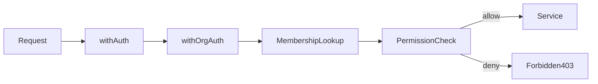

# RBAC Documentation — MaintainerAI Phase 2

## Model

| Concept | Storage | Notes |
| ------- | ------- | ----- |
| Role | `Membership.role` enum | `admin`, `maintainer`, `developer`, `viewer` |
| Permission | Code matrix | `server/auth/permissions.ts` — not DB rows |
| Enforcement | `withOrgAuth` + service asserts | Deny by default |



## Role rank

`admin (4) > maintainer (3) > developer (2) > viewer (1)`

## Permission matrix

| Permission | viewer | developer | maintainer | admin |
| ---------- | :----: | :-------: | :--------: | :---: |
| `org:read` | ✓ | ✓ | ✓ | ✓ |
| `org:update` | | | ✓ | ✓ |
| `org:delete` | | | | ✓ |
| `members:read` | ✓ | ✓ | ✓ | ✓ |
| `members:invite` | | | ✓ | ✓ |
| `members:update_role` | | | | ✓ |
| `members:remove` | | | ✓* | ✓ |
| `invitations:manage` | | | ✓ | ✓ |
| `audit:read` | | | ✓ | ✓ |
| `settings:read` | ✓ | ✓ | ✓ | ✓ |
| `settings:update` | | | ✓ | ✓ |
| `ownership:transfer` | | | | ✓ |

\* Maintainers cannot remove admins. Last-admin / owner protections are enforced in services.

## API enforcement map

| Route | Permission / rule |
| ----- | ----------------- |
| `GET /api/v1/orgs/:orgId` | `org:read` |
| `PATCH /api/v1/orgs/:orgId` | `org:update` |
| `DELETE /api/v1/orgs/:orgId` | `org:delete` (admin); `?leave=true` needs membership (`org:read`) |
| `GET .../members` | `members:read` |
| `PATCH .../members/:userId` | `members:update_role` (admin only) |
| `DELETE .../members/:userId` | `members:remove` |
| `GET/POST .../invitations` | `invitations:manage` / `members:invite` |
| `POST .../invitations` role ceiling | Admins any role; maintainers may invite `developer`/`viewer` only |
| `DELETE .../invitations/:id` | `invitations:manage` |
| `GET/PATCH .../settings` | `settings:read` / `settings:update` |
| `GET .../audit-logs` | `audit:read` |
| `POST .../transfer` | `ownership:transfer` **and** caller must be `ownerUserId` |

## Invitation email binding

Accept/reject requires the signed-in user's GitHub email to **exactly match** the invitation email. Accounts without an email cannot accept email invitations.

## Invitations

Invitations are a Phase 2 schema extension (`Invitation` table):

1. Admin/maintainer creates invitation (`email` + `role`) → opaque `token`
2. Invitee signs in → `POST /api/v1/invitations/:token/accept|reject`
3. Accept creates `Membership` and marks invitation `accepted`
4. Email must match when the user has an email on file
5. Phase 2 does **not** send email; token is returned in the API for accept URL construction

## Helpers

```ts
import { withOrgAuth } from '@/server/middleware/with-auth'
import { roleHasPermission } from '@/server/auth/permissions'

// Route-level
export const GET = withOrgAuth(
  (_ctx, params) => params.orgId,
  async ({ org }) => { /* org.membership.role available */ },
  { permission: 'org:read' },
)
```

## Future (out of Phase 2)

- Installation-scope ceiling (GitHub App) — Phase 3
- System Admin role
- API keys / bearer tokens — post-v1.0
