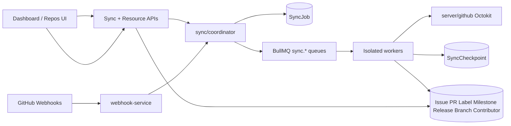

# Sync Architecture

**Phase:** 4 — Repository Synchronization  
**Target tag:** `v0.4.0-repository-sync`

## Overview

## Separation of concerns

| Layer | Responsibility | Must not |
| ----- | -------------- | -------- |
| `server/github` | Octokit DTOs / REST | Persist business rows |
| `server/sync` | Pagination, checkpoints, upserts | AI, health, automation |
| `server/queue/jobs/sync-workers` | Isolate concurrency per domain | Giant mega-worker |
| `server/services/*` | Authz, dashboard DTOs, webhook routing | Long GitHub pagination |
| Dashboard | Read synced cache | Call GitHub directly |

## Lifecycle

1. **Enqueue** — `startRepositorySync` / `enqueueEntitySync` creates `SyncJob` (`queued`) and adds BullMQ job.
2. **Run** — worker sets job `running`, loads checkpoint, pages GitHub.
3. **Persist** — batch upsert local models; `advanceCheckpoint` after each page.
4. **Complete** — `completeCheckpoint`, mark `SyncJob` completed, update `Repository.syncStatus` / timestamps.
5. **Fail** — retry with backoff; after max attempts → failed + DLQ; checkpoint kept for resume.
6. **Cancel** — mark jobs cancelled; workers exit between pages when status is cancelled.

## Modes

| Mode | Behavior |
| ---- | -------- |
| `full` | Reset checkpoints; sync all (or selected) entities from page 1 |
| `incremental` | Prefer `since` watermark; skip completed entities where safe |
| `delta` | Webhook-driven single-entity refresh; optional `ref` (issue/PR number, branch) |

## Queue topology

Nine domain queues + one dead letter:

`sync.repositories` · `sync.issues` · `sync.pullrequests` · `sync.labels` · `sync.milestones` · `sync.releases` · `sync.contributors` · `sync.branches` · `sync.statistics` · `sync.deadletter`

Concurrency is tuned per queue in `sync-workers.ts` (lower for contributors/branches).

## Webhook → sync mapping

| GitHub event | Sync entity |
| ------------ | ----------- |
| `issues` | issues |
| `pull_request` | pull_requests |
| `label` | labels |
| `milestone` | milestones |
| `release` | releases |
| `push` | branches |
| `member` | contributors |
| `repository` / `installation_repositories` | repository (+ disconnect/archive handling) |

Handlers only enqueue; processing remains in workers.

## Data model (additive)

- Ledger: `SyncJob`, `SyncCheckpoint`
- Resources: `Milestone`, `Release`, `Branch`
- Extended: `Repository` sync columns; `Label.githubId`; Issue/PR sync fields (`htmlUrl`, `closedAt`, `draft`, `merged`, …)

Product tables `Issue` / `PullRequest` / `Label` / `Contributor` are reused (same pattern as Phase 3 `Installation`).

## Failure recovery

- Process crash → BullMQ redelivers; checkpoint page resumes.
- Rate limit → exponential backoff on job attempts.
- Transient failures do **not** mark `SyncJob` failed until attempts are exhausted (DLQ handler).
- Permanent failure → DLQ + `markFailed` + `reconcileRepositorySyncStatus`.
- Soft-deleted / archived repos → sync short-circuits; UI hides deleted.
- Statistics debounce uses a stable BullMQ `jobId` and skips enqueue when a delayed/active job already exists (no orphan SyncJob storm).

## Performance levers

- Cursor/page checkpoints
- Per-page batch upserts
- Installation token Redis reuse
- Isolated queue concurrency
- Aggregate list APIs with skip/take pagination
- No inline sync on HTTP hot path

## Out of scope (intentionally)

AI · Repository Health engine · Automation · Analytics · Marketplace · Plugin SDK · CLI · VS Code extension
