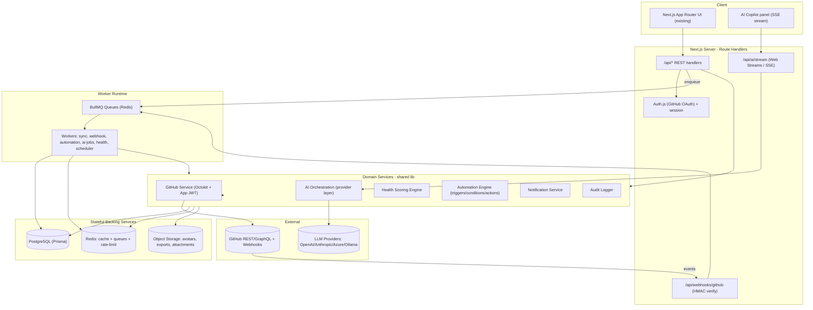
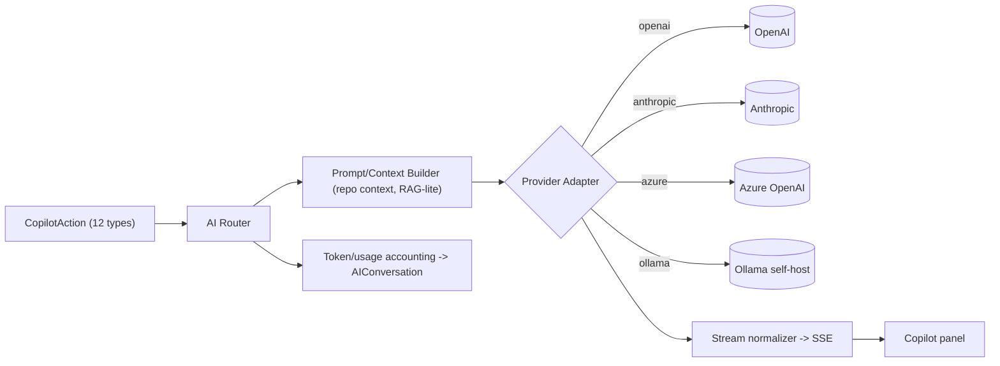
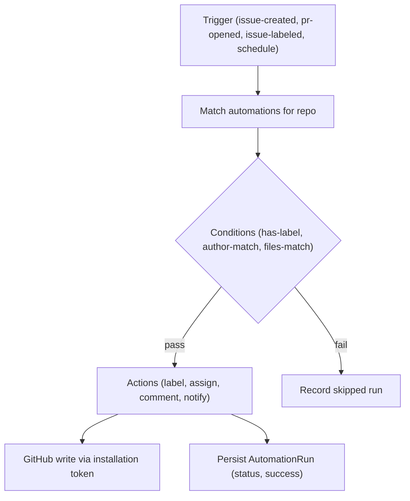
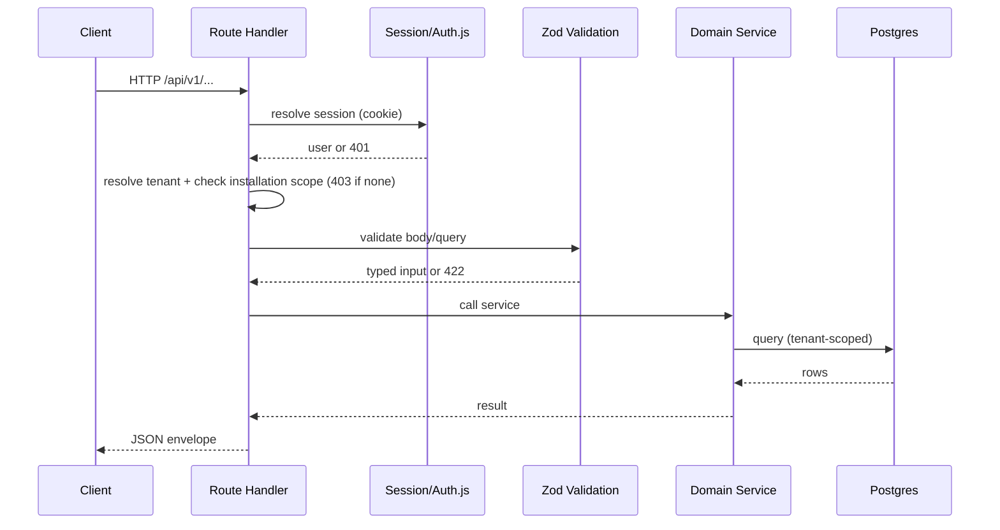
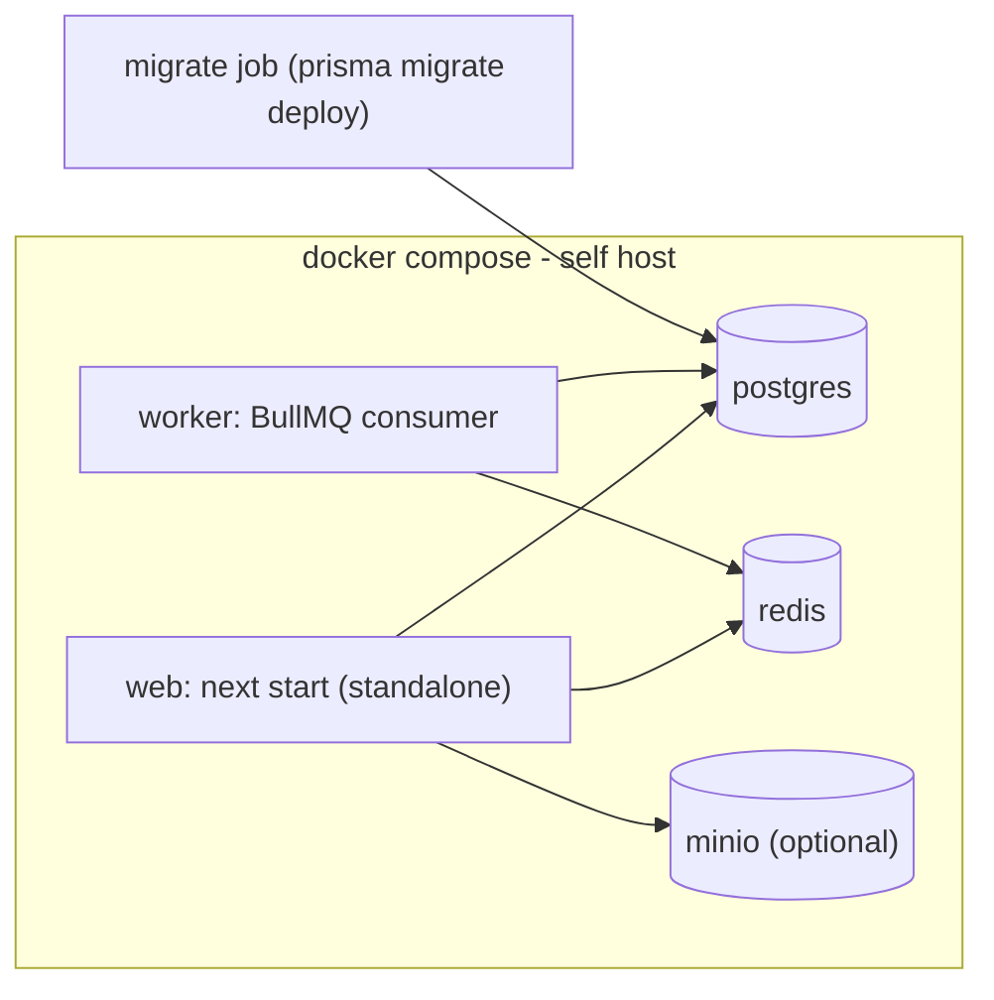
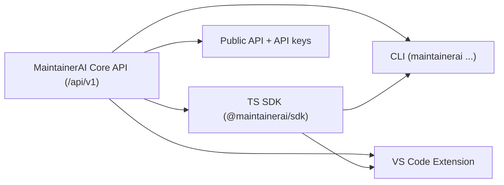

# MaintainerAI — System Architecture

> Target production architecture for MaintainerAI v1.0.
> Design only. No code is implemented as part of this document.
> Companion: `PROJECT_ANALYSIS.md`, `DATABASE_DESIGN.md`, `API_SPECIFICATION.md`, `DEVELOPMENT_ROADMAP.md`.

## 1. Design Principles

1. **Keep the frontend.** The existing Next.js UI and design system are the product surface. The backend replaces `lib/mock-data.ts`, not the components.
2. **GitHub-native.** GitHub is the source of truth. We cache/mirror data locally; we never claim to own it.
3. **Self-hostable first.** Everything must run via `docker compose up` (web + worker + Postgres + Redis). SaaS is the same stack scaled out.
4. **Multi-tenant by construction.** Every row is scoped to an owner (User/Organization) and access is checked against GitHub App installation permissions.
5. **Async by default.** Anything touching GitHub at scale (sync, webhooks, automation, AI) runs through a queue, never inline in a request.
6. **Provider-agnostic AI.** A thin abstraction over OpenAI/Anthropic/Azure/Ollama; swappable via env.
7. **Fail safe.** Signature verification, rate-limit awareness, idempotent webhook processing, and least-privilege tokens are non-negotiable.

## 2. High-Level Architecture

## 3. Component Responsibilities

### 3.1 Next.js App Router
- Continues to serve all existing routes and the marketing site.
- **Server Components** progressively replace client-side mock imports: pages fetch via the internal data-access layer (server-side) instead of importing `lib/mock-data.ts`.
- **Route Handlers** (`app/api/**/route.ts`) expose the REST surface in `API_SPECIFICATION.md`.
- A typed **API client** (`lib/api/*`) centralizes client-side calls (copilot, mutations) so we avoid 20+ ad-hoc `fetch` patterns.

### 3.2 API Routes
- REST, versioned under `/api/v1`. JSON in/out, cursor pagination, consistent error envelope.
- Request pipeline: auth → tenant resolution → authorization (installation scope) → validation (Zod) → service call → response. See §7.

### 3.3 GitHub App
- **Phase 3 status:** Implemented in `server/github/*` (JWT, installation tokens, Octokit REST, install URL).
- App-level **JWT** signed with the App private key → exchanged for short-lived **installation access tokens** (cached in Redis, refreshed before expiry).
- Octokit clients created per-installation. Rate-limit snapshots stored on `Installation`.
- Install callback + repository **metadata** connection are live; issue/PR content permissions remain future-facing.

### 3.4 GitHub OAuth
- **Auth.js** GitHub provider for *user* identity (who is logged in). Distinct from the App installation (which grants repo access).
- Session persisted (database sessions), CSRF-protected, HTTP-only cookies.
- Onboarding flow: OAuth login → prompt App install → installation callback links `Installation` rows to the `User`/`Organization`.

### 3.5 GitHub Webhooks
- Single receiver `/api/webhooks/github`. Verifies `X-Hub-Signature-256` (HMAC-SHA256 with webhook secret) before parsing.
- Persists a `WebhookEvent` row (idempotency via `delivery_id`), enqueues `github.webhooks` / `github.webhook.dispatch`, returns `202` fast (inline fallback without Redis).
- Phase 3 handled events: `installation`, `installation_repositories`, `repository`. All others are logged and ignored.
- Issue/PR/push/release business processing is Phase 4+.

### 3.6 Octokit Layer
- Thin wrapper (`server/github/*`) exposing typed methods used by Phase 3 services: list installation repos, get repo metadata, get installation, rate limit, build install URL, verify user installation access. Issue/PR mutation helpers arrive with later phases.
- Phase 3 uses **REST only**. GraphQL is reserved for later expensive read paths (contributor stats, PR files) and is not implemented yet.

### 3.7 Prisma + PostgreSQL
- Prisma is the single data-access layer. Schema in `DATABASE_DESIGN.md`.
- Migrations via `prisma migrate`; a migration step runs before the web/worker containers start.

### 3.8 Redis
- Three roles: (1) BullMQ queue backend, (2) cache for GitHub responses + installation tokens + health scores, (3) rate limiting (sliding window per user/installation).

### 3.9 BullMQ Workers
- Separate process (`worker` container) consuming queues. Concurrency and backoff per queue. Repeatable jobs for the scheduler (stale sweeps, health recompute, periodic resync).

### 3.10 Object Storage
- S3-compatible (MinIO for self-host, S3/R2 for SaaS). Stores exports (CSV/JSON), generated artifacts (release notes files), cached avatars. Not on the hot path.

## 4. AI Provider Layer

- **Interface:** `AIProvider { chat(stream), complete(), embed() }`. Selected via `AI_PROVIDER` env.
- **Actions** map to prompt templates: the 12 `CopilotAction`s (generate-issue, review-pr, generate-labels, generate-changelog, find-duplicates, etc.) each have a template + required context loader.
- **Context building:** pull relevant repo data (issue/PR bodies, file paths, README) from Postgres/GitHub; keep within token budget. Embeddings optional in v1.0 (pgvector-ready) for duplicate detection and "ask repository".
- **Transport:** server streams tokens via Web Streams to `/api/ai/stream` (SSE), replacing the `setTimeout` in `use-copilot.ts`.
- **Persistence:** every conversation/message and token usage recorded (`AIConversation`, `AIMessage`).

## 5. Automation Engine

- Triggers arrive from webhook jobs or the scheduler.
- Automation definitions are the node graph from `automation-builder.tsx` (trigger → conditions → actions), persisted as `Automation` + `AutomationNode`/`AutomationRun`.
- Execution is idempotent and rate-limit aware; each run logged with success/failure for the UI's runs/successRate metrics.
- Built-in v1.0 automations: auto-label, stale-issue sweep, welcome first-time contributor, issue-claim ("I want to take this").

## 6. Health Scoring Engine

- Pure functions over synced data producing the `RepositoryHealth` shape (codeQuality proxy, documentation, issue/PR backlog, contributor activity, CI status, release frequency, automation coverage, security alerts, dependency health).
- Recomputed on relevant webhooks and on a schedule; results cached in Redis and persisted for history/trends.

## 7. Request & Security Pipeline

**Security controls:** HMAC webhook verification; installation-scoped authorization on every repo resource; least-privilege GitHub permissions; secrets via env/secret manager (App private key, webhook secret, AI keys, DB URL); Redis-backed rate limiting; audit logging of mutations; strict Zod validation; CSRF on session mutations.

## 8. Environment Variables (target contract)

| Variable | Purpose |
| -------- | ------- |
| `DATABASE_URL` | PostgreSQL connection |
| `REDIS_URL` | Redis (cache + queues) |
| `NEXTAUTH_URL` / `NEXTAUTH_SECRET` | Auth.js session |
| `GITHUB_OAUTH_CLIENT_ID` / `_SECRET` | User login |
| `GITHUB_APP_ID` | GitHub App identity |
| `GITHUB_APP_PRIVATE_KEY` | App JWT signing |
| `GITHUB_APP_CLIENT_ID` / `_SECRET` | App OAuth |
| `GITHUB_WEBHOOK_SECRET` | HMAC verification |
| `AI_PROVIDER` / `AI_API_KEY` / `AI_MODEL` | AI layer |
| `AI_BASE_URL` | Ollama/Azure endpoint override |
| `STORAGE_ENDPOINT` / `STORAGE_BUCKET` / keys | Object storage |
| `SENTRY_DSN` | Error monitoring |
| `NEXT_PUBLIC_APP_URL` | Public base URL (already used) |

## 9. Deployment Topology

- **web** and **worker** share the same image but different entrypoints.
- A one-shot **migrate** step runs `prisma migrate deploy` before web/worker.
- Health/readiness endpoints (`/api/health`, `/api/ready`) check DB + Redis.
- Current `Dockerfile` (standalone output) is reused; `docker-compose.yml` gains `postgres`, `redis`, `worker`, and `migrate` services.

## 10. Observability

- **Errors:** Sentry (client + server + worker).
- **Logging:** structured JSON logger (pino) with request IDs; webhook/job correlation IDs.
- **Metrics:** queue depth, job latency, GitHub rate-limit remaining, AI token usage; optional Prometheus endpoint.
- **Audit:** `AuditLog` rows for every mutation (actor, action, target, metadata).

## 11. Plugin System (v1.0 seed → Future)

- **v1.0:** internal "capabilities" registry that the Marketplace UI lists; automations and AI actions are the first first-party plugins. Definitions stored in `Plugin`/`PluginInstallation`.
- **Future:** sandboxed third-party execution (isolated worker, capability-scoped tokens, manifest + permissions), signed distribution.

## 12. Future Interfaces

- The REST API is designed so the SDK/CLI/VS Code extension are thin clients over the same endpoints, authenticated via personal API keys (post-v1.0) rather than session cookies.

## 13. Mapping Old → New (no UI change)

| Today | Target |
| ----- | ------ |
| `lib/mock-data.ts` imports in pages | Server Components + data-access layer (Prisma) |
| `hooks/use-copilot.ts` `setTimeout` | `/api/ai/stream` SSE + AI provider layer |
| Automation "runs" static numbers | `AutomationRun` rows from the engine |
| `mockGitHubApp` | Real `Installation` + token exchange |
| Numeric mock IDs | UUID PKs + GitHub numeric IDs stored separately |
